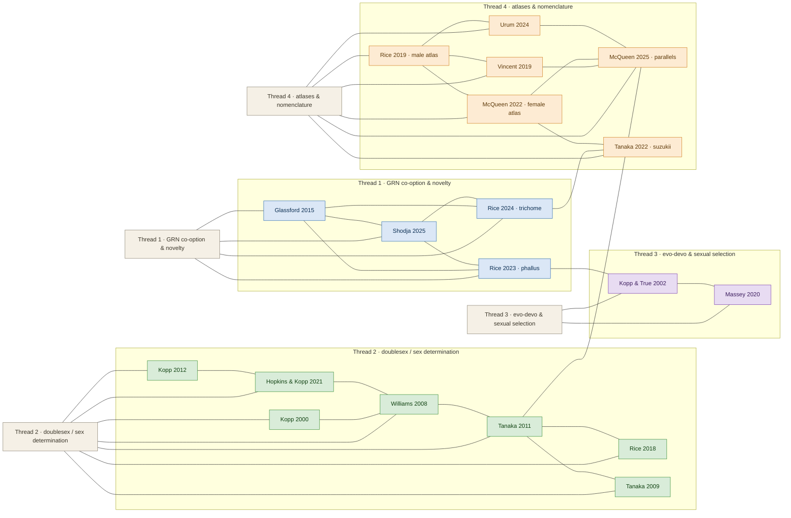

# Research Threads — Network Graph

> Visual network of the vault's research literature, grouped into the four research
> threads and connected by the paper-to-paper relationships documented in the
> literature reviews in `08_Reviews`. Rendered natively by Obsidian (Mermaid).
>
> - **Thread 1** — GRN co-option & morphological novelty (blue)
> - **Thread 2** — *doublesex* / sex determination (green)
> - **Thread 3** — evo-devo, rapid divergence & sexual selection (purple)
> - **Thread 4** — comparative atlases & standardized nomenclature (orange)

## How to read this graph

- **Thread hubs** (light boxes) group each paper into its primary research thread.
- **Edges between papers** are the paper-to-paper relationships documented in the
  `08_Reviews` literature reviews — not asserted from titles.
- Papers sitting at the junction (`Rice 2023 phallus` ↔ `Kopp & True 2002`,
  `Tanaka 2022 suzukii` ↔ `Rice 2024 trichome`, `Tanaka 2011` ↔ `McQueen 2025
  parallels`) are the **connective tissue** bridging threads.

## Related

- [[Research Threads - MOC]] — textual synthesis with full wikilinks & citations
- [[Drosophila Terminalia - MOC]]
- `references/papers_thread_index.csv` — machine-readable paper → thread table