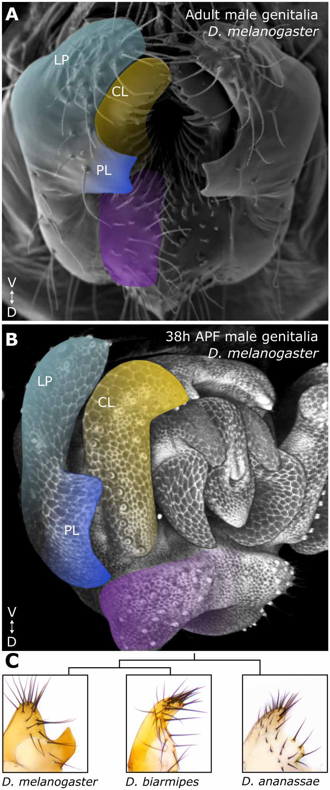
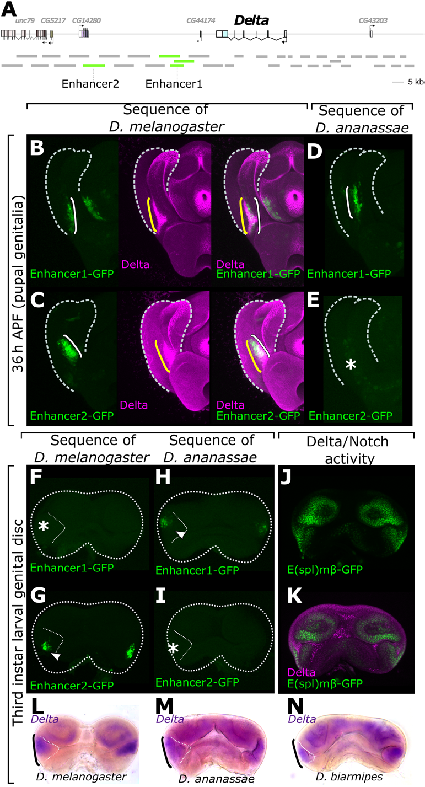
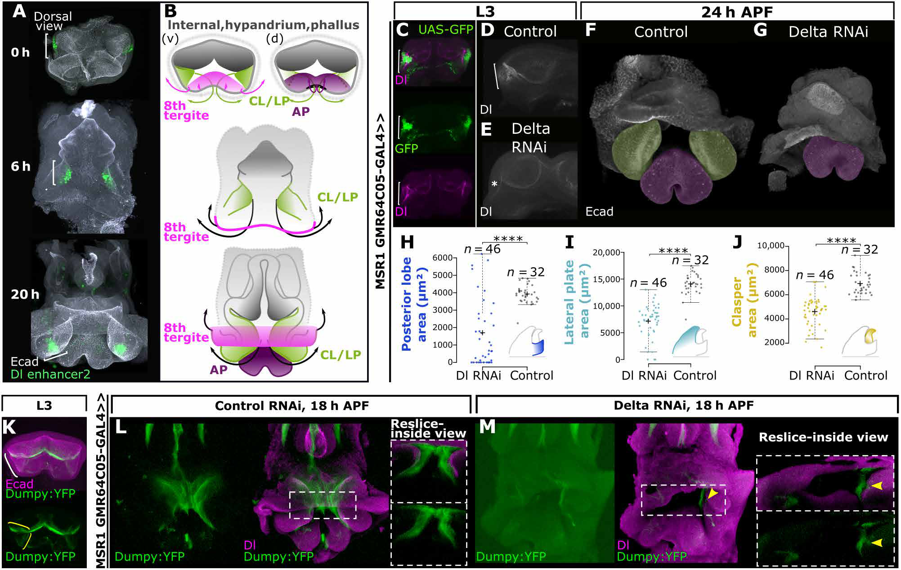

# Literature Review — A Notch signal required for a morphological novelty in Drosophila has antecedent functions in genital disc eversion

> **Source:** [[A Notch signal required for a morphological novelty in Drosophila has antecedent functions in genital disc eversion]] (Shodja, Glassford, Rice, Smith & Rebeiz, *Science Advances*, 2025)
> **DOI:** [10.1126/sciadv.adt7825](https://doi.org/10.1126/sciadv.adt7825)

---

## 1. Background & Significance

This paper directly extends the [[Co-option of an Ancestral Hox-Regulated Network Underlies a Recently Evolved Morphological Novelty]] story. Where Glassford et al. (2015) showed the **posterior lobe** — a novel male genital structure of *D. melanogaster* — arises by co-opting an ancestral Hox-regulated network, this study asks a deeper question: **how do signaling pathways become integrated into new developmental programs?** Specifically, how did a **Notch signaling center** come to be required for posterior-lobe formation?

The answer is surprising and important: the Notch/Delta signaling center required for the posterior lobe **emerged from a pre-existing role in genital disc eversion** — the inside-out turning of the disc during metamorphosis. A novelty was built by re-purposing an antecedent morphogenetic function.

## 2. Research Question

What is the **evolutionary history** of the Notch signaling center required for the posterior lobe? Did it arise de novo, or did it emerge from a pre-existing developmental function (genital disc eversion)?

## 3. Methods

- **Enhancer identification and cross-species reporters:** *Delta* enhancers (Enhancer1, Enhancer2) tested as GFP reporters in *D. melanogaster* and *D. ananassae*.
- **Genetic perturbation:** *Delta* RNAi driven by the genital-disc driver **MSR1 GMR64C05-GAL4** to knock down Delta in the posterior-lobe primordium.
- **Developmental time course:** imaging the genital disc at 0, 6, 20 h and pupal stages (18, 24, 36, 38 h APF).
- **Notch-activity reporter:** E(spl)mβ-GFP to visualize active Delta–Notch signaling.
- **Apical ECM analysis:** Dumpy:YFP to assess the apical extracellular matrix during eversion.

## 4. Key Findings

- A **Notch signaling center** is required for posterior-lobe formation; Delta knockdown causes near-loss of the posterior lobe (plus lateral plate and clasper defects).
- The posterior-lobe signaling center **emerged from a pre-existing role in genital disc eversion** — Delta/Notch is required for the disc to evert inside-out during metamorphosis.
- **Delta contributes to eversion through the apical extracellular matrix**, and this ECM network also became integrated into the posterior-lobe program.
- **Enhancer-specific regulatory evolution** at the *Delta* locus: *melanogaster* Enhancer1 is mainly pupal, Enhancer2 is larval+pupal; in *D. ananassae** Enhancer2 is lost and Enhancer1 timing shifts — mapping species differences to discrete *Delta* enhancers rather than the coding gene.

## 5. Figure-by-Figure Analysis

### Figure 1 — Anatomy and species comparison of the posterior lobe

SEM-style adult and 38 h APF pupal male genitalia, color-coded: **LP** (lateral plate, cyan), **CL** (clasper, yellow), **PL** (posterior lobe, blue/purple). Panel C compares genital morphology across *D. melanogaster*, *D. biarmipes*, and *D. ananassae*. **Interpretation:** establishes the posterior lobe as a discrete, species-specialized outgrowth adjacent to clasper/lateral plate, already patterned by mid-pupal stages, and highly variable across species — setting up the question of how it evolved.

### Figure 2 - Delta enhancers and Notch activity across species/stages

Panel A maps the *Delta* locus and two enhancers. Panels B–E (36 h APF pupal genitalia) and F–I (L3 larval disc) compare *melanogaster* vs. *ananassae* Enhancer1/Enhancer2-GFP activity. Panels J–K show Notch-activity reporter (E(spl)mβ-GFP) apposed to Delta, confirming active signaling. Panels L–N show Delta expression across species. **Interpretation:** Delta/Notch signaling is active in the developing genitalia and tied to posterior-lobe development; species differences map to changes in discrete *Delta* enhancers. Notably, *melanogaster* Enhancer2 (larval+pupal) is lost in *ananassae*, linking enhancer gain to the derived posterior lobe.

### Figure 3 - Delta knockdown disrupts eversion and posterior lobe

Panel A: dorsal-view time series (0, 6, 20 h) of the genital disc with E-cadherin (gray) and Dl enhancer2 (green), showing dynamic Delta activity during eversion. Panel B: schematic of eversion (8th tergite magenta, CL/LP green, AP purple). Panels C–E: Delta RNAi reduces Dl signal. Panels F–G: at 24 h APF, Delta RNAi severely disorganizes CL/LP and posterior structures. Panels H–J: quantification — Delta RNAi significantly reduces **posterior lobe area, lateral plate area, and clasper area** (n=46 vs 32). Panels K–M: Dumpy:YFP apical ECM is disrupted in Delta RNAi (abnormal internal Dumpy accumulation), indicating defective inside-out eversion. **Interpretation:** this is the mechanistic core — an early Delta/Notch-dependent eversion function is *antecedent to*, and required for, formation of the posterior lobe novelty.

## 6. Discussion & Implications

- **Novelties can be built from antecedent morphogenetic functions.** The posterior lobe's signaling center did not arise de novo; it was co-opted from the pre-existing role of Delta/Notch in genital eversion.
- **Apical ECM as a link:** Delta promotes eversion through the apical extracellular matrix, and this ECM network was integrated into the posterior-lobe program — a concrete mechanism for how a signaling center was "re-purposed."
- **Enhancer-centric evolution:** divergence maps to *Delta* enhancers, reinforcing the cis-regulatory view of morphological evolution.
- Together with Glassford (2015), this paints a layered picture: a Hox-regulated network AND a signaling center, both with ancestral functions, were co-opted to build the posterior lobe.

## 7. Limitations

- Focuses on the **posterior lobe** in a small set of species; the generality of "antecedent function co-option" across other novelties needs testing.
- The causal chain (Notch → eversion → posterior lobe) is supported by perturbation, but the full molecular mechanism linking Notch to the apical ECM and to posterior-lobe outgrowth is not fully resolved.
- Enhancer evolution is inferred from reporter activity, not endogenous function.

## 8. Connections to the Knowledge Base

- Directly continues the [[Co-option of an Ancestral Hox-Regulated Network Underlies a Recently Evolved Morphological Novelty]] posterior-lobe story.
- Relevant to [[Morphogen Signaling]] (Notch pathway), [[Genital Disc]], [[Evolution of Genitalia]], and [[Evo-Devo]].
- Enhancer-evolution theme connects to the cis-regulatory evolution literature in the vault.

## Related Papers

- [Co-option of an Ancestral Hox-Regulated Network Underlies a Recently Evolved Morphological Novelty](../01_Sources/co-option-of-an-ancestral-hox-regulated-network-underlies-a-recently-evolved-mor-2015.md)
- [Co-option of the trichome-forming network initiated the evolution of a morphological novelty in Drosophila eugracilis](../01_Sources/co-option-of-the-trichome-forming-network-initiated-the-evolution-of-a-morpholog-2024.md)
- [Resolving between novelty and homology in the rapidly evolving phallus of Drosophila](../01_Sources/resolving-between-novelty-and-homology-in-the-rapidly-evolving-phallus-of-drosop-2021.md)

## Map

[[Drosophila Terminalia - MOC]]

---

#review #drosophila
