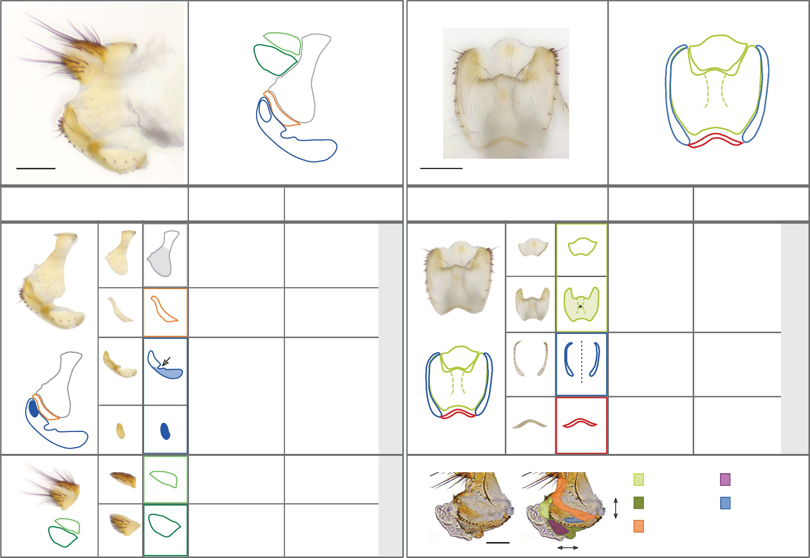

# Literature Review — A standardized nomenclature and atlas of the female terminalia of Drosophila melanogaster

> **Source:** [[A standardized nomenclature and atlas of the female terminalia of Drosophila melanogaster]] (McQueen, Afkhami, Atallah, Belote, Gompel, Heifetz, Kamimura, Kornhauser, Masly, O'Grady, Peláez, Rebeiz, Rice, Sánchez-Herrero, Nunes, Rampasso, Schnakenberg, Siegal, Takahashi, Tanaka, Turetzek, Zelinger, Courtier-Orgogozo, Toda, Wolfner & Yassin, *Fly*, 2022)
> **DOI:** [10.1080/19336934.2022.2058309](https://doi.org/10.1080/19336934.2022.2058309)

---

## 1. Background & Significance

Following the male terminalia atlas (Rice et al., 2019), this paper offers a **detailed description and standardized nomenclature** of the **female terminalia** of *D. melanogaster*. Female genital structures were comparatively understudied and inconsistently named, hampering comparative and developmental work.

## 2. Purpose

- Provide a **detailed description** of female terminalia structures.
- Establish a **standardized nomenclature** with synonyms.
- Serve as a **reference atlas** (the female counterpart to the male atlas).

## 3. Key Content

- **Visual atlas** of female terminalia structures (ovipositor/oviscapt, reproductive tract, epigynium, hypogynium, vaginal plates, anal structures, etc.).
- **Standardized names** for each structure, with synonyms.
- A consensus from **many labs** (26 authors) to harmonize terminology.

## 4. Figure-by-Figure Analysis

### Atlas plates

The atlas presents dissected cuticular structures paired with color-coded line diagrams, decomposing the terminalia into discrete named sclerites, with standardized orientation and consistent color coding across views, plus 3D segmentation. **Interpretation:** the atlas standardizes female terminalia anatomy by linking real dissected morphology to idealized color-coded outlines and 3D models — the foundation for the female molecular atlas ([[Parallels in the regulatory landscape of dimorphic female and male genital structures in Drosophila melanogaster]]).

## 5. Discussion & Implications

- **Standardized female terminology** enables comparative and developmental studies of female genitalia.
- Complements the male atlas, enabling direct male/female comparisons (a theme in the Parallels paper).
- Supports the study of female-specific structures like the reproductive-tract trichomes ([[Trichomes on female reproductive tract: rapid diversification and underlying gene regulatory network in Drosophila suzukii and its related species]]).

## 6. Limitations

- A **reference/nomenclature** paper rather than a functional study.
- Focuses on **D. melanogaster**; cross-species female anatomy is addressed elsewhere.

## 7. Connections to the Knowledge Base

- The female counterpart to [[A Standardized Nomenclature and Atlas of the Male Terminalia of Drosophila melanogaster]].
- Relevant to [[Drosophila Terminalia]], [[Evolution of Genitalia]], and the female molecular atlas.

## Related Papers

- [A Standardized Nomenclature and Atlas of the Male Terminalia of Drosophila melanogaster](../01_Sources/a-standardized-nomenclature-and-atlas-of-the-male-terminalia-of-drosophila-melan-2019.md)
- [Parallels in the regulatory landscape of dimorphic female and male genital structures in Drosophila melanogaster](../01_Sources/parallels-in-the-regulatory-landscape-of-dimorphic-female-and-male-genital-struc-2025.md)
- [An Atlas of Transcription Factors Expressed in Male Pupal Terminalia of Drosophila melanogaster](../01_Sources/an-atlas-of-transcription-factors-expressed-in-male-pupal-terminalia-of-drosophila-melanogaster-2019.md)

## Map

[[Drosophila Terminalia - MOC]]

---

#review #drosophila
