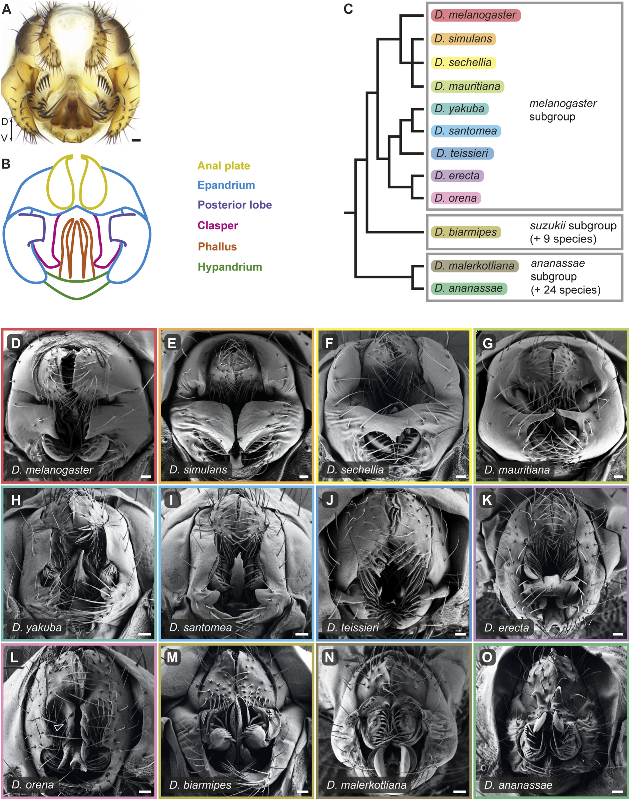

# Literature Review — A developmental atlas of male terminalia across twelve species of Drosophila

> **Source:** [[A developmental atlas of male terminalia across twelve species of Drosophila]] (Urum, Rice, Glassford, Yanku, Shklyar, Rebeiz & Preger-Ben Noon, *Frontiers in Cell and Developmental Biology*, 2024)
> **DOI:** [10.3389/fcell.2024.1349275](https://doi.org/10.3389/fcell.2024.1349275)

---

## 1. Background & Significance

The male terminalia evolve rapidly and are used to distinguish species, yet a **comparative developmental atlas** across species was lacking. This paper provides a **developmental atlas of male terminalia across twelve species of Drosophila**, linking adult morphology to development and phylogeny — a bridge between anatomy (Rice et al., 2019) and developmental/molecular studies.

## 2. Purpose

- Provide a **comparative developmental atlas** of male terminalia across twelve *Drosophila* species.
- Link **adult morphology, development, and phylogeny**.
- Serve as a **resource** for comparative evo-devo of genitalia.

## 3. Key Content

- **Adult male terminalia morphology** documented across twelve species (melanogaster subgroup + suzukii and ananassae outgroups).
- **Color-coded anatomy** (anal plate, epandrium, posterior lobe, clasper, phallus/aedeagus, hypandrium).
- **Phylogenetic framing** of morphological variation.

## 4. Figure-by-Figure Analysis

### Figure 1 — Comparative atlas of adult male terminalia across twelve species

A reference dissection/schematic (A, B) with color-coded anatomy, a phylogeny (C), and SEM panels (D–O) for the twelve species. **Interpretation:** despite a conserved basic terminalia ground plan, male genital morphology varies markedly across species, with the strongest differences in the **posterior lobes, claspers, phallus, and epandrial/hypandrial contours**. Close relatives in the melanogaster subgroup share a recognizable organization with species-specific elaborations, while suzukii/ananassae outgroups show more divergent architectures. The atlas provides **anatomical landmarks** for linking terminalia development to evolutionary diversification.

## 5. Discussion & Implications

- Provides a **comparative developmental framework** for the terminalia, complementing the single-species atlases.
- Enables **cross-species developmental studies** of genital evolution (evo-devo).
- Frames morphological variation **phylogenetically**, linking anatomy to divergence.

## 6. Limitations

- An **atlas** (descriptive morphology); developmental/molecular detail is limited.
- Species sampling is a representative subset of the genus.

## 7. Connections to the Knowledge Base

- The cross-species counterpart to [[A Standardized Nomenclature and Atlas of the Male Terminalia of Drosophila melanogaster]] and [[A standardized nomenclature and atlas of the female terminalia of Drosophila melanogaster]].
- Relevant to [[Drosophila Terminalia]], [[Evolution of Genitalia]], and [[Evo-Devo]].

## Related Papers

- [A Standardized Nomenclature and Atlas of the Male Terminalia of Drosophila melanogaster](../01_Sources/a-standardized-nomenclature-and-atlas-of-the-male-terminalia-of-drosophila-melan-2019.md)
- [A standardized nomenclature and atlas of the female terminalia of Drosophila melanogaster](../01_Sources/a-standardized-nomenclature-and-atlas-of-the-female-terminalia-of-drosophila-mel-2022.md)
- [Parallels in the regulatory landscape of dimorphic female and male genital structures in Drosophila melanogaster](../01_Sources/parallels-in-the-regulatory-landscape-of-dimorphic-female-and-male-genital-struc-2025.md)

## Map

[[Drosophila Terminalia - MOC]]

---

#review #drosophila
