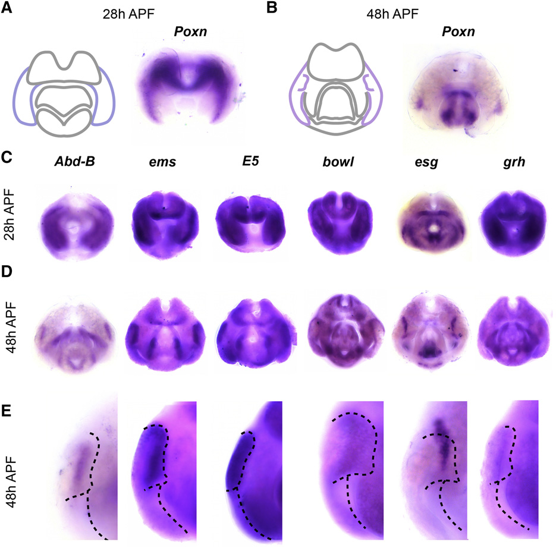

# Literature Review — An Atlas of Transcription Factors Expressed in Male Pupal Terminalia of Drosophila melanogaster

> **Source:** [[An Atlas of Transcription Factors Expressed in Male Pupal Terminalia of Drosophila melanogaster]] (Vincent, Rice, Wong, Glassford, Downs, Shastay, Charles-Obi, Natarajan, Gogol, Zeitlinger & Rebeiz, *G3*, 2019)
> **DOI:** [10.1534/g3.119.400788](https://doi.org/10.1534/g3.119.400788)

---

## 1. Background & Significance

The **male terminalia** are highly patterned during pupal stages, yet a systematic map of the **transcription factors (TFs)** expressed there was lacking. This paper provides a **comprehensive atlas** of TFs expressed in the male pupal terminalia of *D. melanogaster*, identifying which TFs mark which structures/substructures. It is a foundational **community resource** (housed at flyterminalia.pitt.edu) for studying terminalia development.

## 2. Research Question

Which **transcription factors** are expressed in the male pupal terminalia, and do they **mark distinct structures/substructures**? Can this provide a molecular atlas for the developing male genitalia/analia?

## 3. Methods

- **Colorimetric in situ hybridization** for transcription-factor genes in male pupal terminalia at **28 h and 48 h APF**.
- **Whole-mount and lateral/close-up views** to map expression domains.
- **Online database** (flyterminalia.pitt.edu) housing the results as a searchable community resource.

## 4. Key Findings

- The male terminalia are **highly patterned during pupal stages**.
- Specific **transcription factors mark separate structures and substructures** of the terminalia.
- Expression is **stage-dependent**: domains shift from broad early patterns (28 h) to refined, structure-associated patterns (48 h).
- Results are housed in a **searchable online database** as a community resource.

## 5. Figure-by-Figure Analysis

### Figure 1 — TF expression in male pupal terminalia (28 h vs 48 h APF)

Colorimetric in situ hybridization for *Poxn* (A, B) and six markers (*Abd-B, ems, E5, bowl, esg, grh*) (C, D, E) at 28 h and 48 h APF. **Interpretation:** the TFs are **not uniformly expressed**; each has a characteristic, stage-dependent spatial pattern. Between 28 h and 48 h, expression shifts from broad early domains to more refined, structure-associated patterns — e.g., *E5* and *grh* mark broad lateral plates, while *ems/bowl/esg* mark narrow stripes or internal curved regions, and *Abd-B* is faint. This supports their use as **regional markers** for a molecular atlas of the developing male genitalia/analia.

## 6. Discussion & Implications

- Provides a **molecular framework** for dissecting terminalia development.
- The stage-dependent refinement suggests progressive **patterning of the genital disc** into distinct structures.
- A **community resource** enabling future functional and comparative studies (e.g., the Parallels paper's female atlas builds on this).

## 7. Limitations

- An **atlas** (descriptive) — expression patterns without functional perturbation data.
- Focuses on **male** pupal terminalia; the female side was later addressed by McQueen et al. (2022, 2025).

## 8. Connections to the Knowledge Base

- The male counterpart to [[Parallels in the regulatory landscape of dimorphic female and male genital structures in Drosophila melanogaster]] and [[A standardized nomenclature and atlas of the female terminalia of Drosophila melanogaster]].
- Relevant to [[Drosophila Terminalia]], [[Genital Disc]], and [[Imaginal Discs]].

## Related Papers

- [Parallels in the regulatory landscape of dimorphic female and male genital structures in Drosophila melanogaster](../01_Sources/parallels-in-the-regulatory-landscape-of-dimorphic-female-and-male-genital-struc-2025.md)
- [A Standardized Nomenclature and Atlas of the Male Terminalia of Drosophila melanogaster](../01_Sources/a-standardized-nomenclature-and-atlas-of-the-male-terminalia-of-drosophila-melan-2019.md)
- [A standardized nomenclature and atlas of the female terminalia of Drosophila melanogaster](../01_Sources/a-standardized-nomenclature-and-atlas-of-the-female-terminalia-of-drosophila-mel-2022.md)

## Map

[[Drosophila Terminalia - MOC]]

---

#review #drosophila
