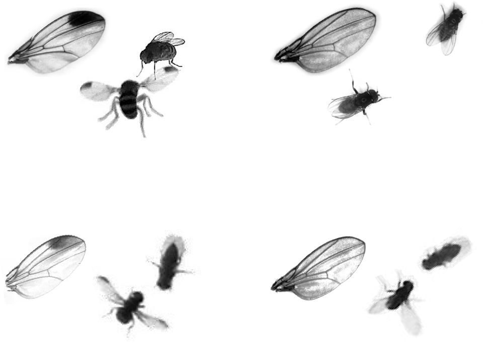
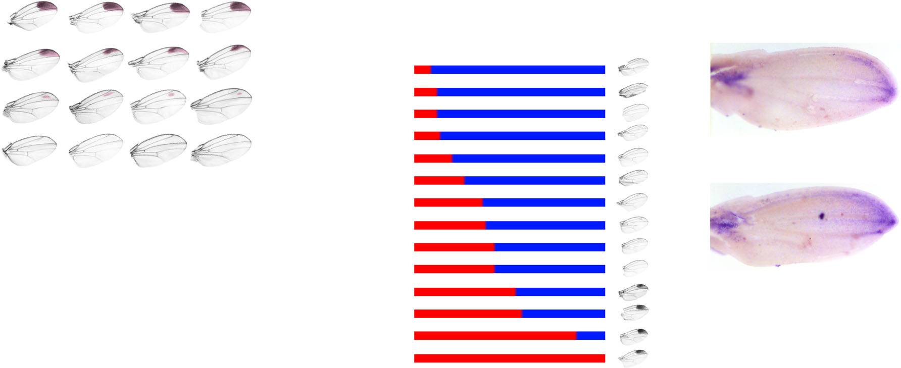
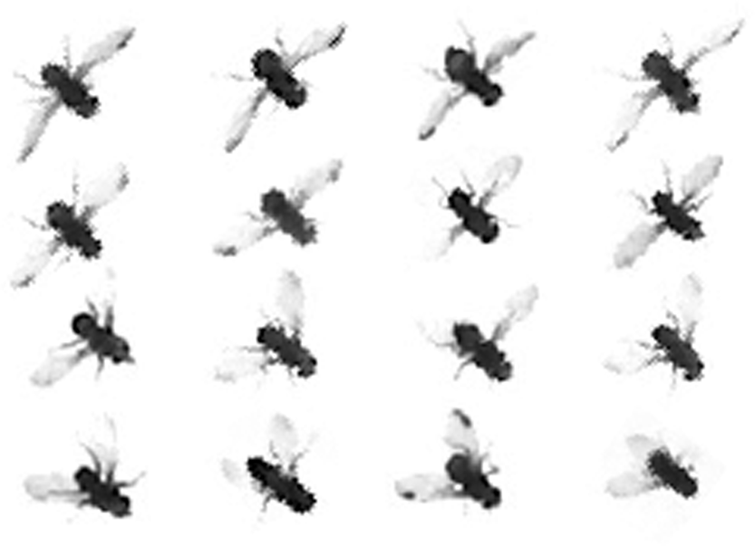

# Literature Review — Co-evolving wing spots and mating displays are genetically separable traits in Drosophila

> **Source:** [[Co-evolving wing spots and mating displays are genetically separable traits in Drosophila]] (Massey, Rice, Firdaus, Chen, Yeh, Stern & Wittkopp, *Evolution*, 2020)
> **DOI:** [10.1111/evo.13990](https://doi.org/10.1111/evo.13990)

---

## 1. Background & Significance

The evolution of sexual traits often involves **correlated changes in morphology and behavior** — e.g., divergent mating displays accompany divergent pigment patterns. A key question is whether such co-evolving traits are coupled by **physical linkage, pleiotropy, or correlated selection**. This paper addresses this using the sibling species *D. elegans* (males have a black wing spot and display it during courtship) and *D. gunungcola* (which lost both traits).

## 2. Research Question

Are the **wing spot** (a male-specific pigment ornament) and the **wing display** (a courtship behavior) genetically coupled or separable? What is the genetic basis of each?

## 3. Methods

- **Multiplexed Shotgun Genotyping (MSG)** to map the genetic basis of wing-spot presence/absence.
- **Introgression** of the X-linked region affecting wing spots from *D. gunungcola* into *D. elegans*.
- **Behavioral observation** of courtship wing displays in wild and introgressed flies.
- **Population sampling** of wild *D. gunungcola* to test independent evolution of the two traits.

## 4. Key Findings

- A ~440 kb region on the **X chromosome** behaves like a **genetic switch** controlling the presence/absence of male wing spots.
- This region includes the candidate gene ***optomotor-blind (omb)***, critical for wing patterning.
- The wing **display** is controlled by a more complex set of loci (at least two X-linked and two autosomal).
- Introgressing the X-linked wing-spot region reduced wing-spot pigmentation but **did not affect the wing display** — the traits are **genetically separable**.
- Wild *D. gunungcola* populations contain males that perform wing displays **despite lacking wing spots**, confirming independent evolution.
- **Correlated selection pressures**, rather than physical linkage or pleiotropy, drive coevolution of these traits.

## 5. Figure-by-Figure Analysis

### Figure 1 — Spotted vs. unspotted wings and display behavior

Composite of wings (spotted vs. clear) paired with whole flies (posed/displaying vs. not). **Interpretation:** establishes the visual contrast — spotted-wing males appear to pose/display with wings extended, while unspotted-wing males do not show the same display — the correlated ornament+behavior phenotype.

### Figure 2 — Wing-spot variation and trait association

A 4×4 morphospace of wing-spot size (large apical patches → faint dots → clear), a stacked-bar series where a "red" state increases in exact register with wing-spot presence, and stained wings showing distal pigment. **Interpretation:** the wing spot and the red-coded trait covary across the series — lineages with elaborate spotted wings are the same ones enriched for the red state — supporting correlated/co-evolutionary change in the ornament.

### Figure 3 — Display array

A ~4×4 grid of flies in various wing/body postures. **Interpretation:** a qualitative array of display variation; supports the behavioral component of the study (variation in wing display posture).

## 6. Discussion & Implications

- **Correlated traits can be genetically separable.** The wing spot and wing display are controlled by different genetic architectures despite co-occurring.
- **Correlated selection, not linkage/pleiotropy**, is the likely driver of their coevolution — a general insight for understanding how suites of sexual traits evolve together.
- Provides a framework for dissecting the genetic basis of correlated morphological + behavioral traits.

## 7. Limitations

- The display trait is more genetically complex and less precisely mapped than the wing spot.
- Wing-spot/display coevolution is inferred from correlation and introgression, not a complete causal demonstration.

## 8. Connections to the Knowledge Base

- Relevant to [[Evolution of Genitalia]] and [[Evo-Devo]] — the same logic of correlated vs. separable trait evolution applies to genital morphology and behavior.
- Complements the cis-regulatory evolution theme in the vault.

## Related Papers

- [Evolution of male sexual characters in the Oriental Drosophila melanogaster species group](../01_Sources/evolution-of-male-sexual-characters-in-the-oriental-drosophila-melanogaster-spec-2002.md)
- [Resolving between novelty and homology in the rapidly evolving phallus of Drosophila](../01_Sources/resolving-between-novelty-and-homology-in-the-rapidly-evolving-phallus-of-drosop-2021.md)

## Map

[[Drosophila Terminalia - MOC]]

---

#review #drosophila
