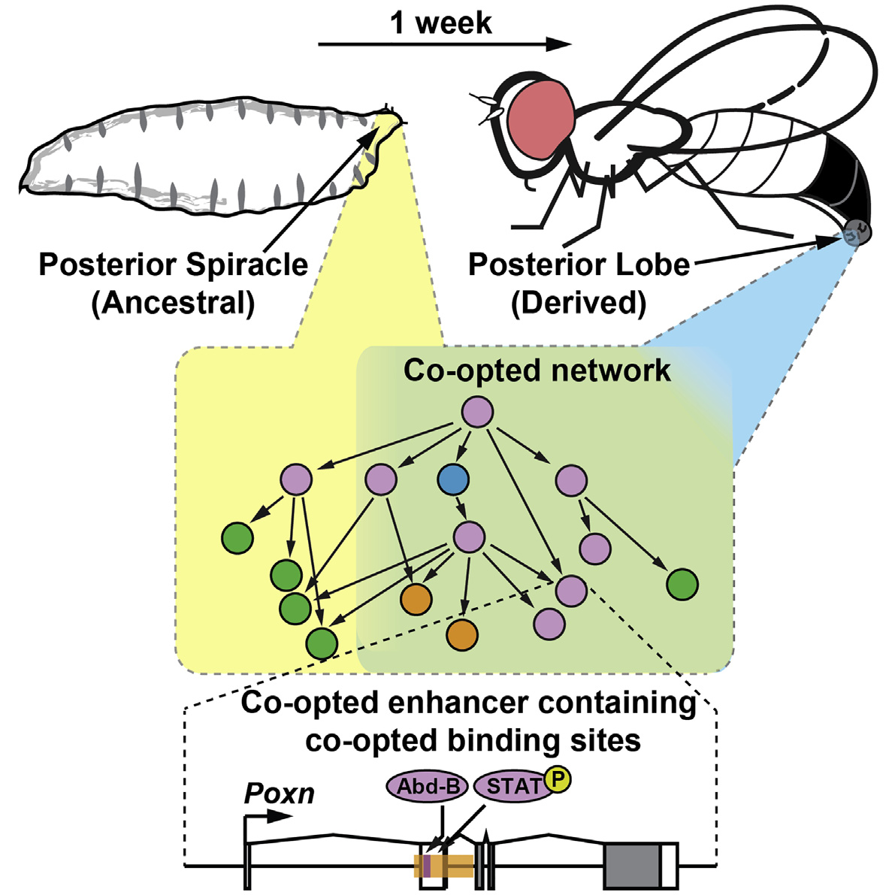
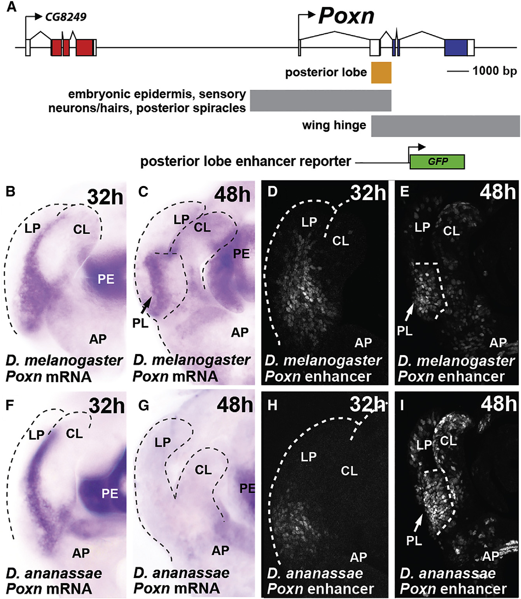
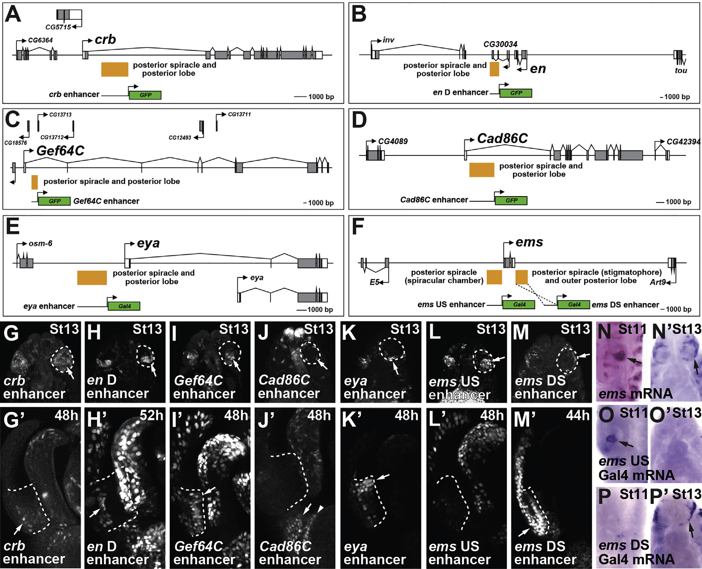

# Literature Review — Co-option of an Ancestral Hox-Regulated Network Underlies a Recently Evolved Morphological Novelty

> **Source:** [[Co-option of an Ancestral Hox-Regulated Network Underlies a Recently Evolved Morphological Novelty]] (Glassford, Johnson, Dall, Smith, Liu, Boll, Noll & Rebeiz, *Developmental Cell*, 2015)
> **DOI:** [10.1016/j.devcel.2015.08.005](https://doi.org/10.1016/j.devcel.2015.08.005)

---

## 1. Background & Significance

How do **complex morphological novelties** — structures with no obvious antecedent, like the vertebrate eye or insect wing — originate? A long-standing hypothesis is that new structures are **not built from scratch** but arise by **co-opting pre-existing gene regulatory networks (GRNs)**. Comparative gene-expression studies support this, but direct molecular evidence at the level of individual regulatory connections had been lacking.

The **posterior lobe** of *D. melanogaster* is an ideal case: it is a **recently evolved, male-specific structure** of the terminalia, unique to the *melanogaster* subgroup. This paper provides the first detailed molecular demonstration that a novelty forms by co-opting an ancestral network — specifically, the **Hox-regulated network** that builds the **larval posterior spiracle** (a breathing structure).

## 2. Research Question

Can a recently evolved morphological novelty be shown, at the level of **specific enhancers and transcription-factor binding sites**, to arise by **co-opting an ancestral gene regulatory network**? The authors test whether the posterior lobe reuses the enhancers and regulatory logic of the posterior spiracle network.

## 3. Methods

- **Enhancer identification and reporter assays:** candidate enhancers cloned upstream of minimal promoters driving GFP/Gal4, tested in embryos and pupal genital discs.
- **Cross-species comparison:** orthologous enhancers tested in *D. melanogaster* and *D. ananassae* (an outgroup lacking the derived posterior lobe).
- **In situ hybridization** for endogenous mRNA (e.g., *Poxn*, *ems*) to compare with reporter activity.
- **Genetic network analysis:** identification of shared genes/enhancers between the posterior spiracle and posterior lobe programs.

## 4. Key Findings

- The posterior lobe employs an **ancestral Hox-regulated network** deployed in the embryo to build the **larval posterior spiracle**.
- **Ten genes, including seven transcription factors**, are shared between the two networks.
- **Seven embryonic regulatory sequences (enhancers)** are re-deployed during genital (posterior lobe) development.
- Co-option occurs at the level of **individual connections between regulatory genes and their enhancers**, with conserved transcription-factor binding sites reused in both ancestral and novel contexts.
- In *D. ananassae*, an orthologous enhancer can still activate reporter expression in the corresponding genital region even though the species lacks the derived posterior lobe — indicating the network was **poised** for co-option.

## 5. Figure-by-Figure Analysis

### Graphical Abstract — "Co-opted network"

A schematic linking the **larval posterior spiracle (ancestral)** to the **adult posterior lobe (derived)** across ~1 week of development. The center shows a shared "co-opted network" with yellow (ancestral) and blue (derived) shading overlapping in green — the same GRN reused in both contexts. The bottom magnifies a **co-opted enhancer** containing binding sites for **Poxn, Abd-B, and activated STAT (P-STAT)** driving the *Poxn* gene. **Interpretation:** the entire paper's thesis is captured here — the novelty arises by redeploying an existing enhancer and its binding sites, integrating Hox (Abd-B) and signaling (STAT) inputs.

### Figure 1 — *Poxn* expression and a posterior-lobe enhancer (D. melanogaster vs. D. ananassae)

Panel A maps the *Poxn* locus and a candidate posterior-lobe enhancer (orange). Panels B–E show *D. melanogaster*: *Poxn* mRNA (B,C) and the enhancer→GFP reporter (D,E) both become concentrated in the developing **posterior lobe (PL)** by 48 h. Panels F–I show *D. ananassae*: endogenous *Poxn* mRNA does **not** show a clear PL domain (F,G), yet the orthologous enhancer→GFP reporter still activates in the corresponding genital region (H,I). **Interpretation:** this is the key evolutionary experiment — the enhancer's ability to drive posterior-lobe expression predates the structure itself, supporting the idea that the network was co-optable before the novelty evolved.

### Figure 5 — Multiple enhancers active in both posterior spiracle and posterior lobe

Panels A–F map enhancers near six genes — *crb*, *en D*, *Gef64C*, *Cad86C*, *eya*, and *ems* (with separable *ems* US and DS fragments) — each annotated "posterior spiracle and posterior lobe." Panels G–M show all seven enhancers active in the **stage-13 embryonic posterior spiracle**; panels G′–M′ show the same enhancers active in the **developing posterior lobe** at 44–52 h. Panels N–P′ confirm the *ems* US/DS reporters recapitulate distinct subsets of endogenous *ems* expression. **Interpretation:** this is the paper's core evidence for network co-option — the *same* enhancers drive expression in both the ancestral (spiracle) and derived (posterior lobe) contexts, demonstrating reuse of an entire regulatory network rather than invention of new elements.

## 6. Discussion & Implications

- **Network co-option is real and mechanistically concrete.** This paper shows co-option at the level of individual enhancer–transcription-factor connections, not just correlated expression.
- **Novelty can arise from redeployment of networks controlling seemingly unrelated structures** (a larval breathing structure → an adult genital structure).
- The *D. ananassae* result implies the regulatory architecture was **pre-adapted** for posterior-lobe expression, consistent with "facilitated variation" / latent co-optability.
- This is a foundational result for the **evo-devo of genitalia** and for understanding **morphological novelty** generally.

## 7. Limitations

- Focuses on a **single novelty** (posterior lobe) in a **single lineage**; generality across other novelties requires further work.
- Demonstrates co-option of *expression*; the **functional necessity** of each shared enhancer for posterior-lobe morphogenesis is not fully established for all seven.
- The *D. ananassae* "poised" enhancer is inferred from reporter activity, not endogenous function.

## 8. Connections to the Knowledge Base

- Directly extends the **posterior lobe** story in [[A Notch signal required for a morphological novelty in Drosophila has antecedent functions in genital disc eversion]] (Shodja et al., 2025), which traces how a Notch signaling center for the posterior lobe emerged from genital eversion.
- Central to [[Hox Genes]], [[Abdominal-B (Abd-B)]], [[Evolution of Genitalia]], and [[Evo-Devo]].
- The enhancer/network co-option theme connects to [[Enhancer evolution and the origins of morphological novelty]] and the cis-regulatory evolution literature.

## Related Papers

- [A Notch signal required for a morphological novelty in Drosophila has antecedent functions in genital disc eversion](../01_Sources/a-notch-signal-required-for-a-morphological-novelty-in-drosophila-has-antecedent-2025.md)
- [Co-option of the trichome-forming network initiated the evolution of a morphological novelty in Drosophila eugracilis](../01_Sources/co-option-of-the-trichome-forming-network-initiated-the-evolution-of-a-morpholog-2024.md)
- [Resolving between novelty and homology in the rapidly evolving phallus of Drosophila](../01_Sources/resolving-between-novelty-and-homology-in-the-rapidly-evolving-phallus-of-drosop-2021.md)

## Map

[[Drosophila Terminalia - MOC]]

---

#review #drosophila
