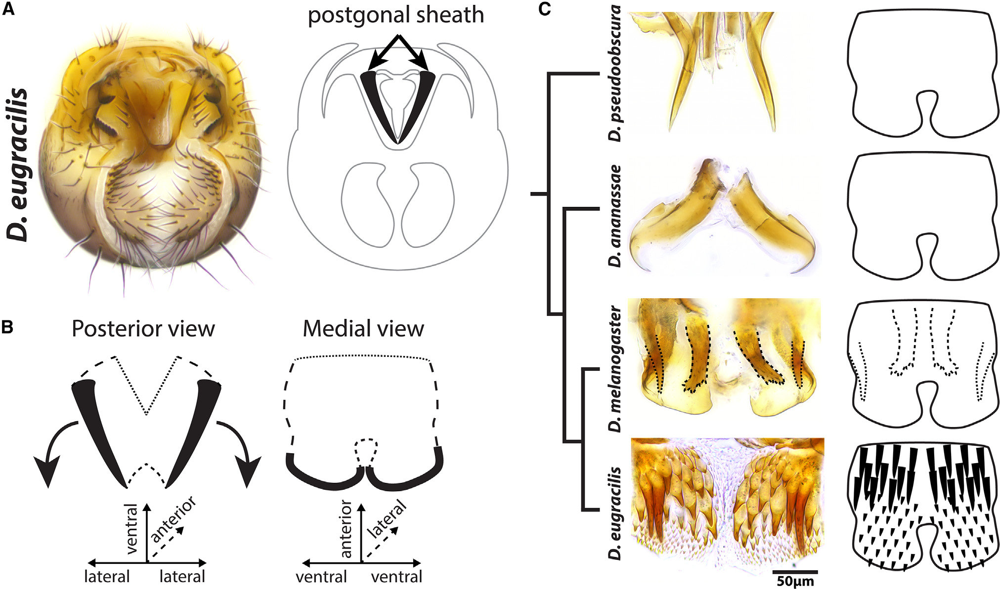
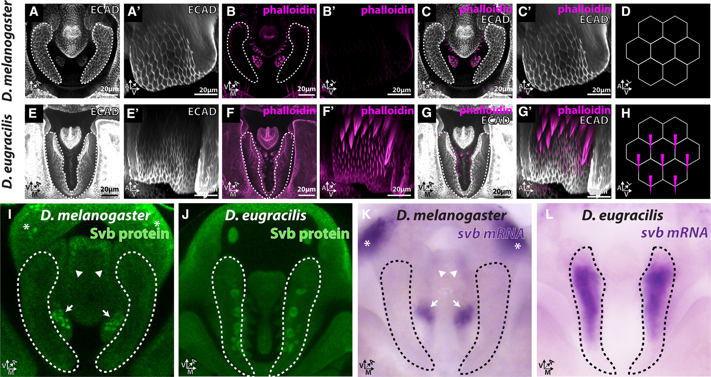

# Literature Review — Co-option of the trichome-forming network initiated the evolution of a morphological novelty in Drosophila eugracilis

> **Source:** [[Co-option of the trichome-forming network initiated the evolution of a morphological novelty in Drosophila eugracilis]] (Rice, Gaitán-Escudero, Charles-Obi, Zeitlinger & Rebeiz, *Current Biology*, 2024)
> **DOI:** [10.1016/j.cub.2024.09.073](https://doi.org/10.1016/j.cub.2024.09.073)

---

## 1. Background & Significance

This paper is a direct continuation of the **network co-option** theme ([[Co-option of an Ancestral Hox-Regulated Network Underlies a Recently Evolved Morphological Novelty]]). It shows that a **morphological novelty** in *D. eugracilis* — a densely bristled/toothed genital structure — arose by **co-opting the conserved trichome-forming network** (centered on *shavenbaby/svb*), which normally builds epidermal trichomes (fine hairs) on the body.

## 2. Research Question

Did a novel male genital structure in *D. eugracilis* evolve by **co-opting the trichome-forming gene regulatory network**? Specifically, is *svb* (the master regulator of trichome formation) redeployed to build the novelty?

## 3. Methods

- **Comparative morphology:** SEM/light microscopy of the novel genital structure across *D. pseudoobscura, ananassae, melanogaster, eugracilis*.
- **Cellular analysis:** ECAD (adherens junctions), phalloidin (F-actin) to detect trichome-like actin projections.
- **Gene expression:** *svb* mRNA (in situ) and Svb protein (immunostaining) in *D. melanogaster* vs. *D. eugracilis*.

## 4. Key Findings

- *D. eugracilis* evolved a **derived, densely bristled/toothed genital structure** (postgonal sheath/posterior lobe region) beyond the simpler states of outgroups.
- The novel structures are **ECAD-positive epithelial appendages** that acquire **dense phalloidin-positive F-actin trichome-like projections**.
- **svb/Svb is strongly upregulated** throughout the *D. eugracilis* structures but not in the homologous *D. melanogaster* tissue.
- The novelty arose by **co-option of the conserved svb-dependent trichome-forming network** into a new anatomical context.

## 5. Figure-by-Figure Analysis

### Figure 1 — The novel D. eugracilis genital structure

Light micrograph + schematic of the *D. eugracilis* male terminalia showing a densely bristled postgonal sheath (A), orientation/movement schematics (B), and a phylogenetic comparison (C) across *pseudoobscura, ananassae, melanogaster, eugracilis*. **Interpretation:** the trait evolves from bare paired sclerites (outgroups) → dotted bristle rows (*melanogaster*) → a novel field of robust trichome-like projections (*eugracilis*), supporting co-option of the trichome network.

### Figure 2 — svb and actin-rich trichomes in the novelty

Comparison of *D. melanogaster* (A–D) vs. *D. eugracilis* (E–H): ECAD outlines the epithelia; **phalloidin** (magenta) reveals dense F-actin trichome-like projections only in *eugracilis*; Svb protein (I–J) and *svb* mRNA (K–L) are **strongly expressed in the *eugracilis* structures** but largely absent from the homologous *melanogaster* tissue. **Interpretation:** the morphological difference is matched by a cis-regulatory/expression difference — *svb* is redeployed into the novel structure, driving actin-rich trichome formation. This is the core evidence for network co-option.

## 6. Discussion & Implications

- **Co-option of a conserved epidermal network** (svb/trichome) into a new genital context generated a morphological novelty.
- Reinforces the general principle that **novelties arise by redeploying existing networks**, not inventing new genes.
- Together with Glassford (2015) and Shodja (2025), this establishes a rich picture of how the terminalia build novelties via co-option.

## 7. Limitations

- Focuses on a **single novelty** in *D. eugracilis*.
- Demonstrates co-option of *expression*; the full functional necessity of svb in the novelty is supported but the complete GRN is not exhaustively mapped.

## 8. Connections to the Knowledge Base

- Directly extends the co-option theme: [[Co-option of an Ancestral Hox-Regulated Network Underlies a Recently Evolved Morphological Novelty]], [[A Notch signal required for a morphological novelty in Drosophila has antecedent functions in genital disc eversion]].
- Relevant to [[Evolution of Genitalia]], [[Evo-Devo]], and [[Drosophila Terminalia]].

## Related Papers

- [Co-option of an Ancestral Hox-Regulated Network Underlies a Recently Evolved Morphological Novelty](../01_Sources/co-option-of-an-ancestral-hox-regulated-network-underlies-a-recently-evolved-mor-2015.md)
- [A Notch signal required for a morphological novelty in Drosophila has antecedent functions in genital disc eversion](../01_Sources/a-notch-signal-required-for-a-morphological-novelty-in-drosophila-has-antecedent-2025.md)
- [Trichomes on female reproductive tract: rapid diversification and underlying gene regulatory network in Drosophila suzukii and its related species](../01_Sources/trichomes-on-female-reproductive-tract-rapid-diversification-and-underlying-gene-2022.md)

## Map

[[Drosophila Terminalia - MOC]]

---

#review #drosophila
