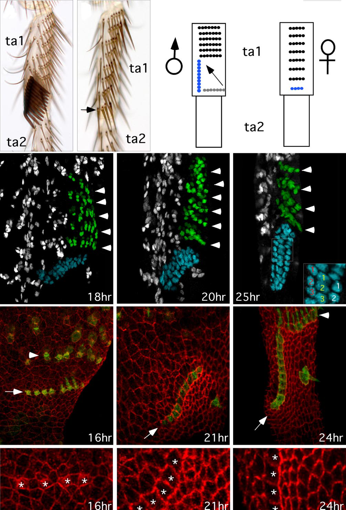

# Literature Review — Distinct developmental mechanisms underly the evolutionary diversification in Drosophila: sex combs

> **Source:** [[Distinct developmental mechanisms underlie the evolutionary diversification in Drosophila: sex combs]] (Tanaka, Barmina & Kopp, *PNAS*, 2009)
> **DOI:** [10.1073/pnas.0807493106](https://doi.org/10.1073/pnas.0807493106)

---

## 1. Background & Significance

Similar selective pressures can lead to the **independent origin of similar morphological structures** in multiple lineages. This paper asks whether similar **sex-comb** morphology in closely related *Drosophila* species is produced by the **same or different developmental mechanisms**. It is a key study on **convergent evolution** and developmental constraint.

## 2. Research Question

Do similar sex combs across *Drosophila* species arise by the **same developmental mechanism**, or can **distinct mechanisms** produce convergent morphology?

## 3. Methods

- **Adult morphology:** comparison of sex-comb position (ta1 vs. ta2), row number, and orientation across species.
- **Pupal developmental time course:** confocal imaging of sex-comb precursor patterning (18–25 h APF) and epithelial mechanics (16–24 h APF).
- **Cell rearrangement analysis:** tracking precursor cells and epithelial cell intercalation.

## 4. Key Findings

- In *D. melanogaster*-type development, the **longitudinal adult sex comb is not born longitudinal** — it originates as part of a **transverse bristle row** and **rotates ~90° during pupal development** via epithelial cell rearrangement/convergent extension.
- Evolutionarily diversified sex combs (different segmental position, row number, orientation) are produced by **distinct developmental mechanisms** — rotation/remodeling of an ancestral transverse row in some lineages vs. altered prepatterning/bristle specification and segmental deployment in others.
- **Similar adult traits are not necessarily built the same way.**

## 5. Figure-by-Figure Analysis

### Figure 1 — Sex-comb morphology and pupal development

Adult forelegs (ta1/ta2) showing sex-comb position variation; a pupal time course (18, 20, 25 h APF) showing the green sex-comb precursor row changing from a transverse cluster into a longitudinal comb row; and epithelial mechanics (16–24 h) showing convergent-extension/cell-intercalation as the comb aligns longitudinally. **Interpretation:** the longitudinal comb forms by **~90° rotation of an ancestral transverse bristle row** through cell rearrangement, and different species achieve similar combs by **different developmental routes**.

## 6. Discussion & Implications

- **Convergent morphology can hide divergent development** — a caution for inferring shared mechanisms from similar adult structures.
- Both **Scr-dependent patterning** and **downstream morphogenesis** contribute to sex-comb diversification.
- Relevant to the homology-vs-novelty theme ([[Resolving between novelty and homology in the rapidly evolving phallus of Drosophila]]).

## 7. Limitations

- Focuses on **sex combs** (leg structures); the terminalia extension is inferred.
- The developmental mechanisms are characterized for a limited set of species.

## 8. Connections to the Knowledge Base

- Complements [[Evolution of sex-specific traits through changes in HOX-dependent doublesex expression]] (Tanaka et al., 2011).
- Relevant to [[Hox Genes]], [[Evolution of Genitalia]], and [[Evo-Devo]].

## Related Papers

- [Evolution of sex-specific traits through changes in HOX-dependent doublesex expression](../01_Sources/evolution-of-sex-specific-traits-through-changes-in-hox-dependent-doublesex-expr-2011.md)
- [Evolving doublesex expression correlates with the origin and diversification of male sexual ornaments in the Drosophila immigrans species group](../01_Sources/evolving-doublesex-expression-correlates-with-the-origin-and-diversification-of-2018.md)

## Map

[[Drosophila Terminalia - MOC]]

---

#review #drosophila
