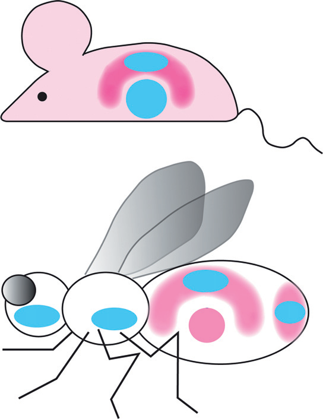

# Literature Review — Dmrt genes in the development and evolution of sexual dimorphism

> **Source:** [[Dmrt genes in the development and evolution of sexual dimorphism]] (Kopp, *Trends in Genetics*, 2012)
> **DOI:** [10.1016/j.tig.2011.12.002](https://doi.org/10.1016/j.tig.2011.12.002)

---

## 1. Background & Significance

This is a **review** of the **DM-domain (Dmrt) family of transcription factors**, which play central roles in sexual development across animals. In *Drosophila*, the Dmrt gene **doublesex (dsx)** is the terminal switch of the sex-determination cascade. The review highlights common themes in sexual development across taxa, discusses how Dmrt genes have **acquired new roles during animal evolution**, and shows how they contributed to the **origin of novel sex-specific traits**.

## 2. Core Argument

Dmrt genes are a conserved family of transcription factors (defined by the **DM domain**) that are central to sexual differentiation across diverse animal lineages. Despite very different upstream sex-determination mechanisms, Dmrt genes — especially *dsx* in insects and *Dmrt1* in vertebrates — act as conserved downstream regulators, and their deployment explains much of sexual dimorphism.

## 3. Key Findings / Themes

- Dmrt genes encode transcription factors with a conserved **DM domain**.
- In *Drosophila*, the Dmrt gene **doublesex (dsx)** is the terminal switch of the sex-determination cascade.
- Dmrt genes have **acquired new roles during animal evolution** (e.g., *dsx* controlling sex combs, genitalia, pigmentation).
- Dmrt genes contributed to the **origin of novel sex-specific traits**.

## 4. Figure-by-Figure Analysis

### Figure 1 — Conserved Dmrt machinery across mammal and insect

A two-panel schematic of a mouse (vertebrate) and a fly (insect), using matched color motifs (blue/pink) to equate Dmrt-family activity in gonadal/genital and other sex-specific tissues. **Interpretation:** deeply conserved transcription factors (Dmrt1 in vertebrates, Dsx in insects) are reused in sexual differentiation across very different body plans — evolution conserves the master regulators while deploying them to produce lineage-specific dimorphisms.

## 5. Discussion & Implications

- **Dmrt genes are a conserved "toolkit"** for sexual differentiation, analogous to Hox genes for body patterning.
- The *dsx* story in *Drosophila* (sex combs, genitalia, pigmentation) exemplifies how a conserved Dmrt gene acquires new roles to build novel sex-specific traits.
- Connects insect and vertebrate sexual development under a common molecular umbrella.

## 6. Limitations

- A review — synthesizes existing work; the mechanistic detail is largely from *Drosophila*.
- The cross-taxa conservation is at the level of gene family, not necessarily identical function.

## 7. Connections to the Knowledge Base

- Directly relevant to [[Doublesex (dsx)]] and [[Sex Determination in Drosophila]].
- The "acquired new roles" theme connects to [[Evolution of Genitalia]] and [[Evo-Devo]].
- Complements [[Evolution of sexual development and sexual dimorphism in insects]] (Hopkins & Kopp, 2021).

## Related Papers

- [Evolution of sexual development and sexual dimorphism in insects](../01_Sources/evolution-of-sexual-development-and-sexual-dimorphism-in-insects-2021.md)
- [Evolution of sex-specific traits through changes in HOX-dependent doublesex expression](../01_Sources/evolution-of-sex-specific-traits-through-changes-in-hox-dependent-doublesex-expr-2011.md)

## Map

[[Drosophila Terminalia - MOC]]

---

#review #drosophila
