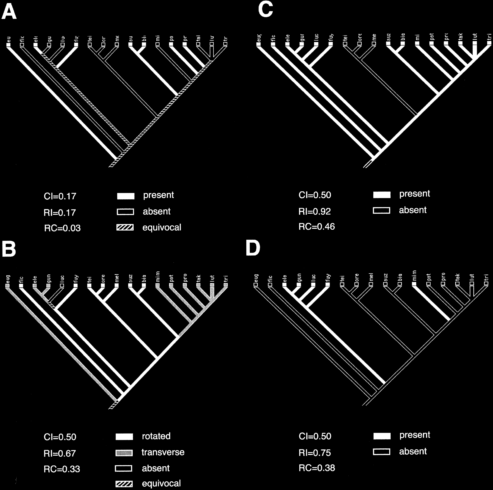

# Literature Review — Evolution of male sexual characters in the Oriental Drosophila melanogaster species group

> **Source:** [[Evolution of male sexual characters in the Oriental Drosophila melanogaster species group]] (Kopp & True, *Evolution & Development*, 2002)
> **DOI:** [10.1046/j.1525-142X.2002.02017.x](https://doi.org/10.1046/j.1525-142X.2002.02017.x)

---

## 1. Background & Significance

This paper uses a **molecular phylogeny** of the Oriental *D. melanogaster* species group to reconstruct the evolution of **male sexual characters** — including genitalia and sex combs. It is foundational for understanding how sexually dimorphic characters **diverge rapidly** among closely related species and how they map onto phylogeny.

## 2. Research Question

How do **male sexual characters** evolve across the Oriental *melanogaster* group? Do different characters evolve at different rates or with different phylogenetic patterns?

## 3. Methods

- **Molecular phylogeny** of the Oriental *melanogaster* group.
- **Character-state reconstruction** of male sexual/genital characters onto the phylogeny.
- **Fit statistics** (CI, RI, RC) to quantify how well each character maps onto the tree.

## 4. Key Findings

- Male sexual/genital characters **evolve very differently** on the same species tree.
- There is a spectrum from **highly labile, homoplastic traits** (low CI/RI/RC — repeated gains/losses) to **clade-specific, synapomorphic traits** (high RI/RC).
- Some structures **track phylogeny** well enough to define subclades, while others **change repeatedly**, consistent with strong sexual selection and frequent convergence/reversal.
- Male sexual characters diverge **very rapidly** among closely related species.

## 5. Figure-by-Figure Analysis

### Figure 1 — Character-state reconstructions on the species phylogeny

Four cladograms (A–D) of Oriental *melanogaster*-group species with character states coded at tips/branches and fit statistics. **Interpretation:** the contrast between Panel A (very low CI=0.17, RI=0.17, RC=0.03 — highly homoplastic/labile) and Panel C (high RI=0.92, RC=0.46 — clade-specific/conservative) shows a **spectrum of evolutionary modes** for different male sexual characters. Some are repeatedly gained/lost; others define subclades. This supports **mosaic, rapid evolution** of male sexual characters under sexual selection.

## 6. Discussion & Implications

- **Different male sexual characters evolve at different rates** and with different phylogenetic signal — a mosaic pattern.
- Rapid, convergent/reversible evolution is consistent with **sexual selection** driving genital/sexual-trait divergence.
- Provides a phylogenetic framework for the terminalia/genitalia evolution work in this vault.

## 7. Limitations

- Character-state reconstruction is **qualitative** (based on the phylogeny and fit statistics shown).
- Focuses on the **Oriental group**; broader generalization requires more taxa.

## 8. Connections to the Knowledge Base

- Provides the phylogenetic context for [[Evolution of Genitalia]] and the terminalia atlases.
- Relevant to [[Evo-Devo]] and the rapid-evolution theme in [[Resolving between novelty and homology in the rapidly evolving phallus of Drosophila]].

## Related Papers

- [Co-evolving wing spots and mating displays are genetically separable traits in Drosophila](../01_Sources/coevolving-wing-spots-and-mating-displays-are-genetically-separable-traits-in-dr-2020.md)
- [Resolving between novelty and homology in the rapidly evolving phallus of Drosophila](../01_Sources/resolving-between-novelty-and-homology-in-the-rapidly-evolving-phallus-of-drosop-2021.md)

## Map

[[Drosophila Terminalia - MOC]]

---

#review #drosophila
