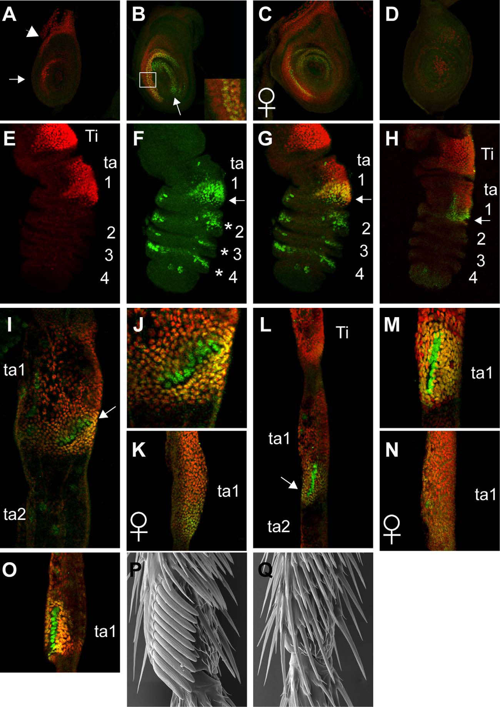
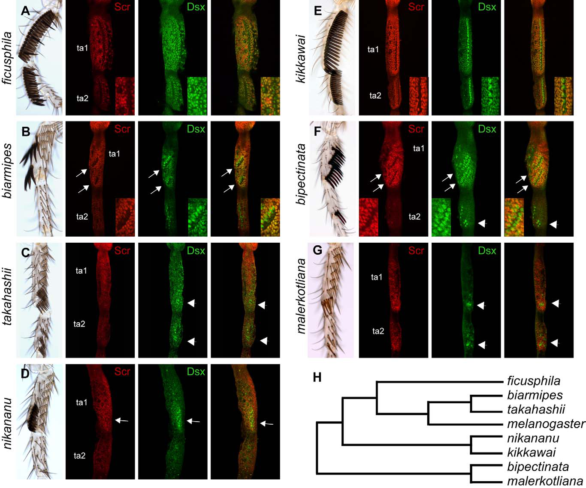
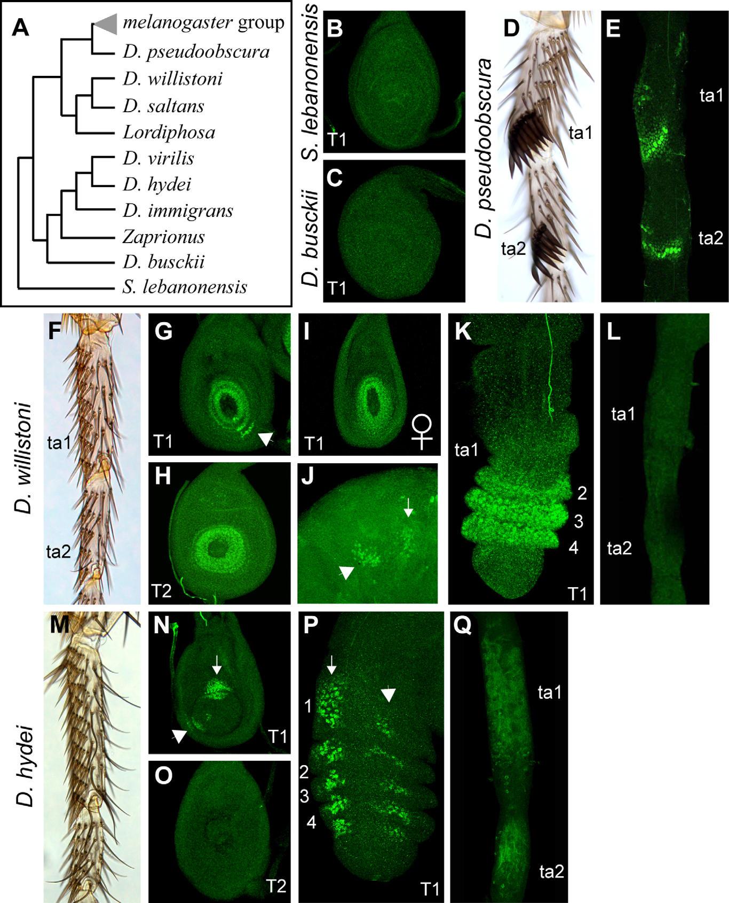

# Literature Review — Evolution of sex-specific traits through changes in HOX-dependent doublesex expression

> **Source:** [[Evolution of sex-specific traits through changes in HOX-dependent doublesex expression]] (Tanaka, Barmina, Sanders, Arbeitman & Kopp, *PLOS Biology*, 2011)
> **DOI:** [10.1371/journal.pbio.1001131](https://doi.org/10.1371/journal.pbio.1001131)

---

## 1. Background & Significance

Almost every animal lineage has **unique sex-specific traits**, implying such traits are **gained and lost frequently** in evolution. Yet the genetic mechanisms behind these gains/losses were poorly understood. In *Drosophila*, the sex-determination pathway is active mainly in **sexually dimorphic tissues**, suggesting that **spatial regulation of the sex-determination pathway** (not the pathway itself) may drive the evolution of sex-specific traits.

The **sex comb** — a male-specific array of modified bristles on the first leg (tarsus) — is a recent evolutionary innovation that shows dramatic diversity across species. It is a tractable model for how new sex-specific structures originate and diversify.

## 2. Research Question

How does the **spatial regulation of doublesex (dsx)** — the main transcriptional effector of the sex-determination pathway — contribute to the **origin and diversification** of the sex comb? Specifically, how does dsx interact with **HOX positional information** (Sex combs reduced, Scr) to build this novelty?

## 3. Methods

- **Gene expression analysis:** in situ/immunofluorescence for **dsx** and **Scr** in developing forelegs (imaginal discs and pupal tarsi).
- **Cross-species comparative analysis:** expression patterns and sex-comb morphology across multiple *Drosophila* species and outgroups.
- **Genetic manipulation:** examining how dsx and Scr interact (dsx up-regulating Scr, and vice versa) in the presumptive sex-comb region.

## 4. Key Findings

- dsx expression in the presumptive sex-comb region is **activated by the HOX gene Scr** (Sex combs reduced).
- The **male isoform of dsx (DSX^M) up-regulates Scr**, so both genes become highly expressed in this region in males but not females — a positive feedback/co-expression module.
- **Precise spatial regulation of dsx is essential** for defining sex-comb position and morphology.
- Species that **primitively lack sex combs show no dsx expression** in the homologous region.
- The origin and diversification of sex combs were linked to the **gain of a new dsx expression domain** within the Scr-defined HOX territory.

## 5. Figure-by-Figure Analysis

### Figure 1 — dsx and Scr intersect to build the male sex comb

Confocal/SEM of the developing foreleg (Ti = tibia, ta1–ta4 = tarsal segments). The sex comb forms on **ta1** (basitarsus). Red/green channels compare dsx and Scr; overlap (yellow) marks cells where the male sex-comb program is induced. Adult SEM shows a normal male comb (P) vs. a feminized/loss condition (Q). **Interpretation:** the sex comb arises at the **intersection of HOX positional information (Scr: "this is first-leg ta1")** and **sexual identity (DSX^M)**. In females, DSX^F prevents the male program despite the leg being in the Scr domain.

### Figure 4 — Scr and Dsx expression across seven species

For each species (A–G), brightfield tarsus + Scr (red) + Dsx (green) + merge, with a phylogeny (H). Sex-comb size/position differs by species (e.g., *ficusphila* and *kikkawai* strong combs; *takahashii* slender; *bipectinata* comb teeth at ta1/ta2 boundary). Dsx is more spatially restricted and species-variable, overlapping Scr in or near comb-forming cells. **Interpretation:** evolution of the sex comb is associated with **redeployment of Dsx downstream of Scr** — changes in where/how strongly Dsx is expressed in ta1/ta2 correspond to comb gains, losses, rotations, or repositioning.

### Figure 5 — dsx redeployment across the Drosophilidae phylogeny

A broad phylogeny (A) with adult combs (D, F, M) and dsx expression (green) in leg discs/tarsi across *pseudoobscura, willistoni, hydei*, outgroups (*S. lebanonensis, D. busckii*), etc. Comb-bearing species show **focal DSX-positive fields matching comb position/number** (e.g., *pseudoobscura* ta1+ta2 combs correspond to punctate ta1 + strong ta2 DSX). Outgroups lacking the derived comb lack the focused pattern. **Interpretation:** sex-comb evolution occurred largely through **changes in the spatial regulation of dsx by HOX-patterned leg fields** (Scr/T1 context), not by inventing dsx itself.

## 6. Discussion & Implications

- **Changes in the spatial regulation of sex-determining genes are a key mechanism** enabling the evolution of new sex-specific traits.
- The **dsx–Scr positive feedback** module is a concrete example of how a sex-determination effector and a HOX gene cooperate to build a novelty.
- This is directly relevant to the **terminalia**: the same logic (HOX + dsx) patterns the genital disc, so the sex-comb findings generalize to genital evolution.
- Provides a framework for the **gain/loss of sex-specific traits** across lineages.

## 7. Limitations

- Focuses on the **sex comb** (a leg structure); the direct extension to genitalia is inferred.
- Expression correlation with morphology is strong but **not fully causal** for every species.
- The exact cis-regulatory changes driving dsx redeployment are not fully resolved here (addressed in later work, e.g., the modular dsx enhancers paper).

## 8. Connections to the Knowledge Base

- Central to [[Doublesex (dsx)]], [[Hox Genes]], and [[Sex Determination in Drosophila]].
- The HOX+dsx logic directly parallels terminalia patterning ([[Genital Disc]], [[Drosophila Terminalia]]).
- Complements [[The regulation and evolution of a genetic switch controlling sexually dimorphic traits in Drosophila]] (Williams et al., 2008), which shows Abd-B + DSX regulating a *bab* switch.
- Relevant to [[Evolution of Genitalia]] and [[Evo-Devo]].

## Related Papers

- [The regulation and evolution of a genetic switch controlling sexually dimorphic traits in Drosophila](../01_Sources/the-regulation-and-evolution-of-a-genetic-switch-controlling-sexually-dimorphic-2008.md)
- [Genetic control and evolution of sexually dimorphic characters in Drosophila](../01_Sources/genetic-control-and-evolution-of-sexually-dimorphic-characters-in-drosophila-2000.md)
- [Distinct developmental mechanisms underlie the evolutionary diversification in Drosophila: sex combs](../01_Sources/distinct-developmental-mechanisms-underlie-the-evolutionary-diversification-of-d-2009.md)
- [Evolving doublesex expression correlates with the origin and diversification of male sexual ornaments in the Drosophila immigrans species group](../01_Sources/evolving-doublesex-expression-correlates-with-the-origin-and-diversification-of-2018.md)

## Map

[[Drosophila Terminalia - MOC]]

---

#review #drosophila
