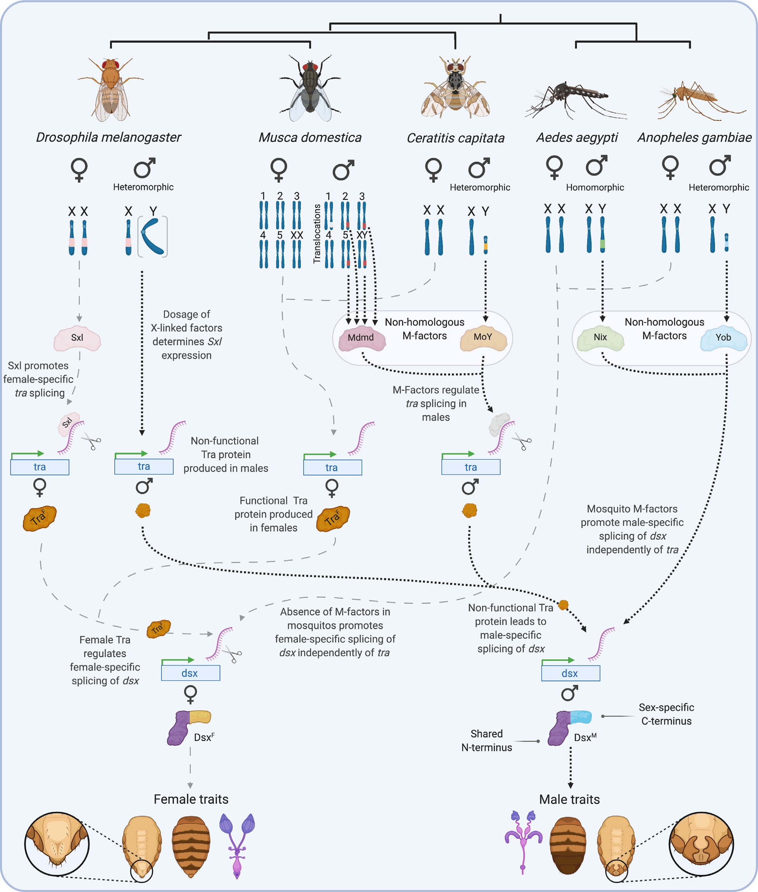
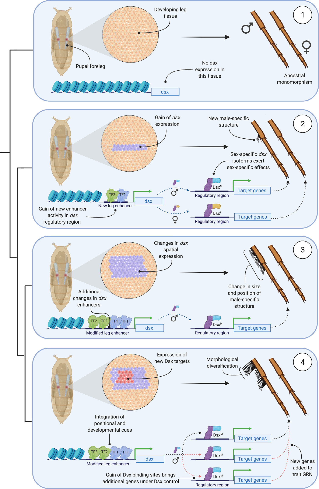

# Literature Review — Evolution of sexual development and sexual dimorphism in insects

> **Source:** [[Evolution of sexual development and sexual dimorphism in insects]] (Hopkins & Kopp, *Current Opinion in Genetics & Development*, 2021)
> **DOI:** [10.1016/j.gde.2021.02.011](https://doi.org/10.1016/j.gde.2021.02.011)

---

## 1. Background & Significance

This is a **synthesis review** that draws together molecular-genetic and developmental work across a broad range of insects to describe the **evolution of sexual dimorphism** from a comparative perspective. Its central argument: insect sex determination and differentiation systems are **composites of rapidly evolving and highly conserved elements** — the downstream switch (*doublesex*) is conserved, while the upstream primary signals are evolutionarily labile.

## 2. Core Argument

Sex differences are dramatic at morphological/physiological/behavioral levels yet **slight or absent at the genomic level**. This disconnect is overcome because simple genetic differences or environmental signals direct the **sex-specific expression of a shared genome**. The canonical picture came from *Drosophila*; recent work on other insects reveals how the system evolves.

## 3. Key Findings / Themes

- The **downstream switch (doublesex/dsx)** is deeply conserved across insects and produces sex-specific isoforms (Dsx^F/Dsx^M) that drive dimorphic morphology (genitalia, pigmentation, etc.).
- The **upstream primary signals are evolutionarily labile and repeatedly replaced**: X-chromosome dose/Sxl in *Drosophila*, unrelated male-determiners (Mdmd, MoY) in higher flies acting through *tra*, and Nix/Yob in mosquitoes acting directly on *dsx*.
- Insect sex-determination systems are **composites of rapidly evolving and highly conserved elements**.

## 4. Figure-by-Figure Analysis

### Figure 1 — Sex-determination cascades across five flies/mosquitoes

Columns for *D. melanogaster*, *Musca domestica*, *Ceratitis capitata*, *Aedes aegypti*, and *Anopheles gambiae*, showing sex chromosomes, upstream signal, *tra* splicing, and the conserved *dsx* output. **Interpretation:** the downstream *dsx* switch is conserved (shared N-terminus, sex-specific C-terminus), while the upstream factors are **non-homologous and repeatedly replaced** — convergent evolution of sex determination onto a conserved *dsx* output.

### Figure 2 — Stepwise model for evolving a sexually dimorphic leg trait

A four-step schematic: (1) ancestral monomorphism (no *dsx* in leg); (2) origin of dimorphism by **gaining a new *dsx* leg enhancer** → *dsx* expressed in a leg cell cluster → sex-specific isoforms build a male structure; (3) refinement of the *dsx* expression domain (size/position changes); (4) expansion of the downstream GRN by **gaining Dsx binding sites** in new target genes → morphological diversification. **Interpretation:** elaborate dimorphic structures evolve **stepwise** — first deploying *dsx* into a tissue via a new enhancer, then refining its spatial expression, then recruiting new Dsx targets — emphasizing **regulatory DNA and network connectivity** over changes in the *dsx* coding sequence.

## 5. Discussion & Implications

- **Conserved switch, labile inputs** is the key evolutionary insight — the same *dsx* logic is reused across insects with very different upstream mechanisms.
- Provides a general framework for understanding the evolution of sexual dimorphism, directly applicable to the terminalia (genitalia are a major *dsx* output).
- The stepwise model (Figure 2) generalizes the sex-comb and genital stories in this vault.

## 6. Limitations

- A review — synthesizes existing work rather than presenting new data.
- Focuses on insects; the broader animal picture (e.g., Dmrt in vertebrates) is covered in [[Dmrt genes in the development and evolution of sexual dimorphism]].

## 7. Connections to the Knowledge Base

- Central to [[Sex Determination in Drosophila]], [[Doublesex (dsx)]], [[Evolution of Genitalia]], and [[Evo-Devo]].
- The conserved-switch/labile-input theme connects to [[Dmrt genes in the development and evolution of sexual dimorphism]] (Kopp, 2012).

## Related Papers

- [Dmrt genes in the development and evolution of sexual dimorphism](../01_Sources/dmrt-genes-in-the-development-and-evolution-of-sexual-dimorphism-2012.md)
- [Evolution of sex-specific traits through changes in HOX-dependent doublesex expression](../01_Sources/evolution-of-sex-specific-traits-through-changes-in-hox-dependent-doublesex-expr-2011.md)
- [The regulation and evolution of a genetic switch controlling sexually dimorphic traits in Drosophila](../01_Sources/the-regulation-and-evolution-of-a-genetic-switch-controlling-sexually-dimorphic-2008.md)

## Map

[[Drosophila Terminalia - MOC]]

---

#review #drosophila
