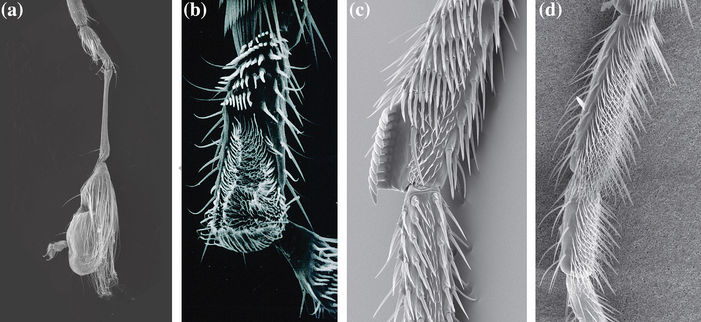
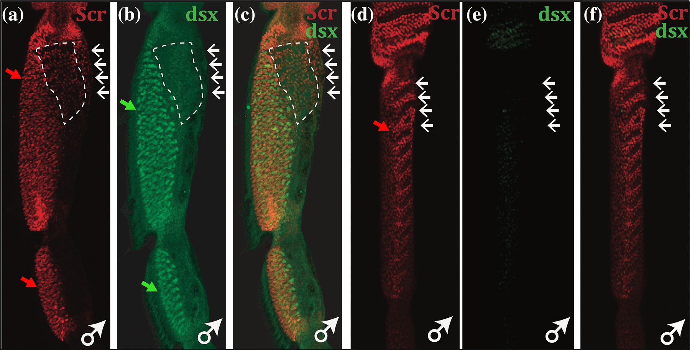

# Literature Review — Evolving doublesex expression correlates with the origin and diversification of male sexual ornaments in the Drosophila immigrans species group

> **Source:** [[Evolving doublesex expression correlates with the origin and diversification of male sexual ornaments in the Drosophila immigrans species group]] (Rice, Barmina, Hu & Kopp, *Evolution & Development*, 2018)
> **DOI:** [10.1111/ede.12249](https://doi.org/10.1111/ede.12249)

---

## 1. Background & Significance

Male-specific **sexual ornaments** — such as the sex comb and tarsal brushes on the foreleg — are among the most rapidly evolving traits in *Drosophila*. This paper tests whether the **origin and diversification** of these ornaments in the *D. immigrans* species group are associated with changes in **doublesex (dsx) expression**, extending the sex-comb work of Tanaka et al. (2011) to a new species group with diverse male ornaments.

## 2. Research Question

Do changes in **dsx expression** (and its relationship to the HOX gene *Scr*) correlate with the **origin and diversification** of male sexual ornaments in the *D. immigrans* group?

## 3. Methods

- **SEM/morphology:** documentation of male tarsal/foreleg ornaments across the *immigrans* group.
- **Gene expression:** confocal imaging of **Scr** and **dsx** in developing male ornament tissue across species.
- **Comparative analysis:** correlating dsx/Scr expression with ornament presence/divergence.

## 4. Key Findings

- The *immigrans* group shows **diverse male tarsal ornaments** (sex-comb-like teeth, spur setae, dense fringes).
- In species with ornaments, **dsx is broadly expressed and overlaps Scr** in the developing ornament region.
- In a comparison male, **Scr expression is retained but dsx is lost/drastically reduced** — an evolutionary **decoupling of dsx from Scr**.
- Changes in **dsx expression** correlate with the divergence/loss of male sexual ornaments.

## 5. Figure-by-Figure Analysis

### Figure 1 — SEM of male tarsal ornaments across the immigrans group

Four SEM panels showing diverse male foreleg/tarsal ornaments: sex-comb-like rows of thickened bristles/teeth, long spur-like setae, and dense plumose fringes. **Interpretation:** establishes the morphological diversity of male ornaments in the group, setting up the question of their developmental/genetic basis.

### Figure 3 — Scr and dsx expression in developing male ornaments

Confocal images comparing two males. In the first (a–c), **dsx (green) broadly overlaps Scr (red)** in the developing ornament/terminalia (yellow merge), consistent with dsx acting with Scr to pattern the trait. In the comparison male (d–f), **Scr is retained but dsx is essentially absent** (red-only pattern). **Interpretation:** this is the key evolutionary result — an evolutionary **decoupling of dsx from Scr**, implicating changes in dsx expression in the divergence/loss of male ornaments.

## 6. Discussion & Implications

- **Changes in dsx deployment** (not the protein itself) drive the origin and diversification of male ornaments — consistent with the cis-regulatory view.
- The **dsx–Scr relationship is evolvable**: dsx can be lost from an Scr-expressing territory, decoupling the sex-determination input from HOX positional information.
- Extends the sex-comb model (Tanaka et al., 2011) to a new species group, showing the generality of dsx redeployment.

## 7. Limitations

- Focuses on **leg ornaments** (not terminalia per se), though the dsx logic is shared.
- Correlative; the causal enhancer changes driving dsx loss are not fully resolved here.

## 8. Connections to the Knowledge Base

- Directly extends [[Evolution of sex-specific traits through changes in HOX-dependent doublesex expression]] (Tanaka et al., 2011).
- Relevant to [[Doublesex (dsx)]], [[Hox Genes]], [[Evolution of Genitalia]], and [[Evo-Devo]].

## Related Papers

- [Evolution of sex-specific traits through changes in HOX-dependent doublesex expression](../01_Sources/evolution-of-sex-specific-traits-through-changes-in-hox-dependent-doublesex-expr-2011.md)
- [Distinct developmental mechanisms underlie the evolutionary diversification in Drosophila: sex combs](../01_Sources/distinct-developmental-mechanisms-underlie-the-evolutionary-diversification-of-d-2009.md)

## Map

[[Drosophila Terminalia - MOC]]

---

#review #drosophila
