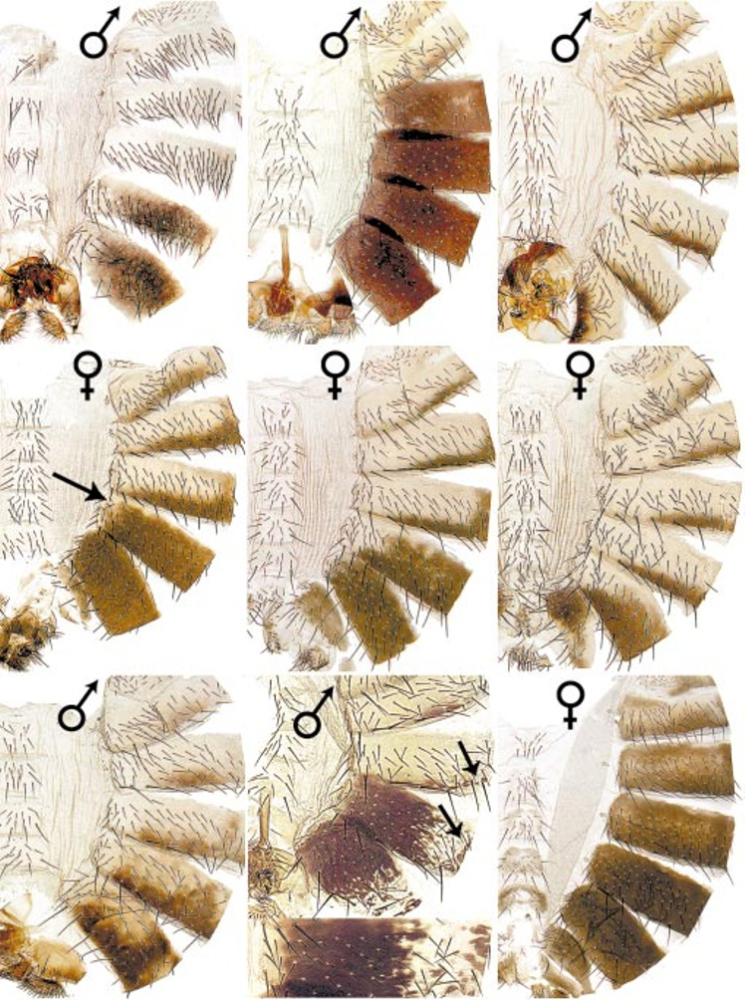
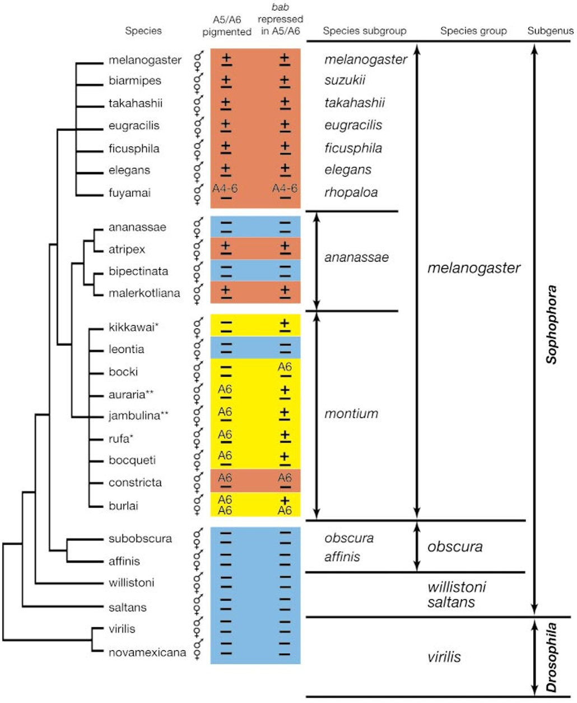
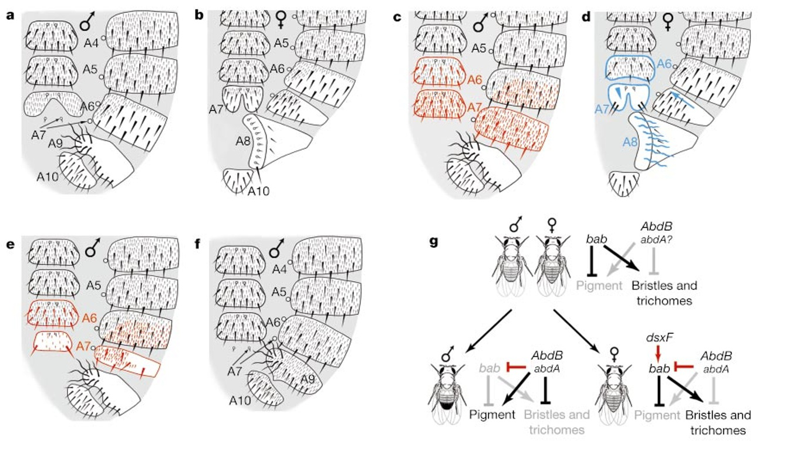

# Literature Review — Genetic control and evolution of sexually dimorphic characters in Drosophila

> **Source:** [[Genetic control and evolution of sexually dimorphic characters in Drosophila]] (Kopp, Duncan, Godt & Carroll, *Nature*, 2000)
> **DOI:** [10.1038/35046017](https://doi.org/10.1038/35046017)

---

## 1. Background & Significance

This is the **foundational paper** establishing *bric à brac (bab)* as the major determinant of sexually dimorphic pigmentation and morphology in the posterior abdomen of *Drosophila*. Sexually dimorphic abdominal pigmentation and segment morphology **evolved recently** in the *melanogaster* species group, making it a tractable case for understanding how sex-specific characters arise.

The paper's central proposal — that *bab* has an **ancestral homeotic function** and that **regulatory changes at the *bab* locus** drove the evolution of sexual dimorphism — set the agenda for a large body of subsequent work (including Williams et al. 2008 and the terminalia atlases in this vault).

## 2. Research Question

What gene controls sexually dimorphic abdominal pigmentation and morphology in *Drosophila*, and how did this control evolve? Specifically: is *bab* the determinant, and did **cis-regulatory changes** at *bab* underlie the evolution of dimorphism?

## 3. Methods

- **Genetic analysis:** identification of *bab* as a determinant of sexually dimorphic pigmentation and segment morphology.
- **Expression analysis:** *bab* expression in a sexually dimorphic pattern in the posterior abdomen, regulated by the sex-determination pathway.
- **Phylogenetic/trait mapping:** scoring pigmentation and *bab* repression across many *Drosophila* species/subgroups to trace evolutionary transitions.
- **Regulatory model building:** integrating *dsx* (sex) and *Abd-B/abd-A* (Hox) inputs to *bab*.

## 4. Key Findings

- The **bric à brac (bab)** gene is a major determinant of sexually dimorphic pigmentation and morphology in the posterior abdomen.
- *bab* is expressed in a **sexually dimorphic pattern** in the posterior abdomen, regulated by the sex-determination pathway.
- In females, *bab* represses male-type pigmentation; in males, reduced *bab* permits dark A5/A6 pigmentation.
- *bab* has an **ancestral homeotic function**; **regulatory changes at the *bab* locus** played a key role in the evolution of sexual dimorphism.
- Changes in *bab*-mediated repression in posterior segments (A5/A6, A4–6) are associated with **repeated gains/losses** of dimorphic pigmentation across species.

## 5. Figure-by-Figure Analysis

### Figure 1 — bab and sex-specific abdominal pigmentation

A montage of male (♂) and female (♀) abdomens. Wild-type males show the classic **dark A5/A6 melanized cap**; females show transverse segmental bands. Arrows highlight masculinized females (gain of male pigment) and ectopic-pigmentation males. **Interpretation:** *bab* is the switch — female posterior *bab* expression represses male-type melanization; loss of *bab* in females masculinizes, ectopic *bab* in males feminizes.

### Figure 3 — Phylogenetic/trait matrix of bab repression and pigmentation

A cladogram of *Drosophila* species with female/male rows scored for "A5/A6 pigmented" and "bab repressed in A5/A6" (+/−), color-coded by subgroup. The *melanogaster* subgroup shows the canonical male-specific loss of posterior pigmentation coinciding with *bab* repression; the *ananassae* and especially *montium* subgroups show heterogeneous, labile transitions (including A6-restricted traits); outgroups lack the derived dimorphism. **Interpretation:** *bab*-mediated repression in posterior segments is associated with **repeated, independent gains/losses** of dimorphic pigmentation — evolution is labile and regulatory, not a single invariant mechanism.

### Figure 4 — Regulatory model: bab integrates dsx and Hox inputs

Panels a–f compare male/female abdominal cuticle maps (A4–A10) under manipulations, showing that changing *bab* shifts segments toward the opposite sexual pattern (loss of female *bab* masculinizes; ectopic *bab* in males feminizes). Panel g diagrams the logic: **dsxF activates *bab*** in females; *bab* then represses male-type pigment and modifies bristles/trichomes, while **Abd-B/abd-A** provide segmental positional input. **Interpretation:** *bab* is a central integrator translating the sex-determination signal (*dsx*) and segmental Hox information (*Abd-B/abd-A*) into sex-specific pigmentation and cuticular morphology — via cis-regulatory control, not protein-coding change.

## 6. Discussion & Implications

- **Regulatory evolution of a single locus** (*bab*) can generate sexually dimorphic traits — a paradigm for how sex-specific characters evolve.
- The **ancestral homeotic function** of *bab* means the dimorphic role was built on pre-existing function (an early statement of the co-option theme developed later in this vault).
- This paper laid the foundation for the *bab* genetic-switch work (Williams et al. 2008) and for the broader understanding of how **dsx + Hox** inputs pattern sexually dimorphic structures, including terminalia.

## 7. Limitations

- Focuses on **abdominal pigmentation**; the terminalia connection is established in later work.
- The phylogenetic trait mapping is qualitative (ancestral-state reconstruction/statistics not shown).

## 8. Connections to the Knowledge Base

- The *bab* switch is elaborated in [[The regulation and evolution of a genetic switch controlling sexually dimorphic traits in Drosophila]] (Williams et al., 2008).
- Relevant to [[Sex Determination in Drosophila]], [[Doublesex (dsx)]], [[Hox Genes]], and [[Evo-Devo]].
- The dsx + Hox integration logic directly parallels terminalia patterning ([[Genital Disc]], [[Drosophila Terminalia]]).

## Related Papers

- [The regulation and evolution of a genetic switch controlling sexually dimorphic traits in Drosophila](../01_Sources/the-regulation-and-evolution-of-a-genetic-switch-controlling-sexually-dimorphic-2008.md)
- [Evolution of sex-specific traits through changes in HOX-dependent doublesex expression](../01_Sources/evolution-of-sex-specific-traits-through-changes-in-hox-dependent-doublesex-expr-2011.md)
- [Dmrt genes in the development and evolution of sexual dimorphism](../01_Sources/dmrt-genes-in-the-development-and-evolution-of-sexual-dimorphism-2012.md)

## Map

[[Drosophila Terminalia - MOC]]

---

#review #drosophila
