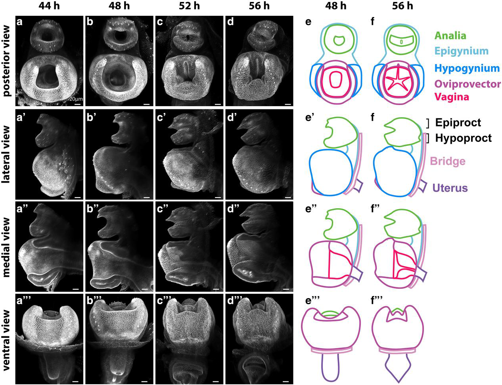
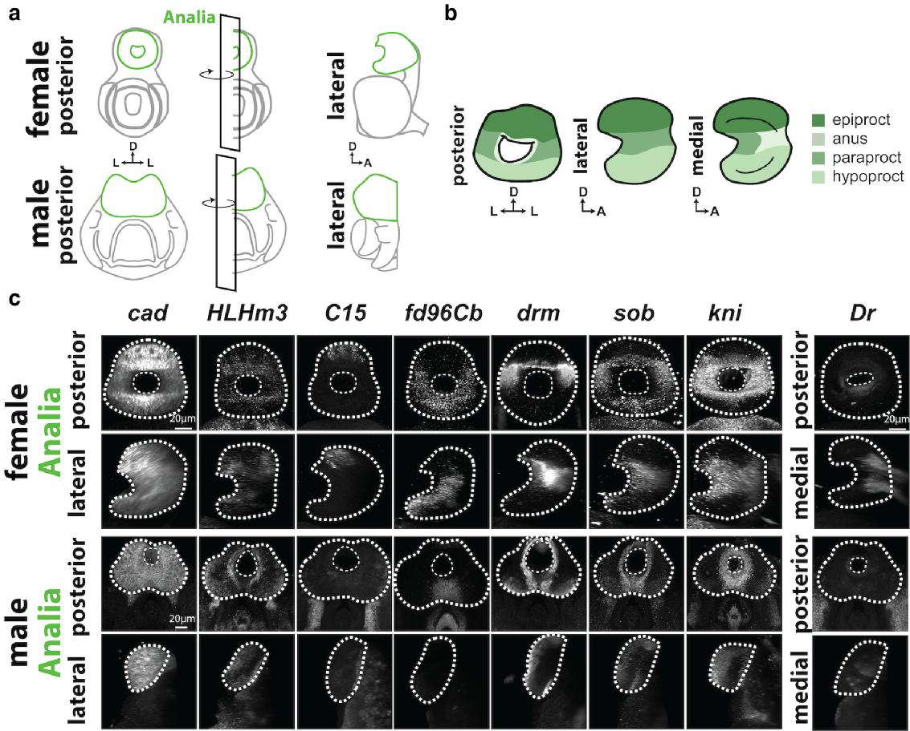
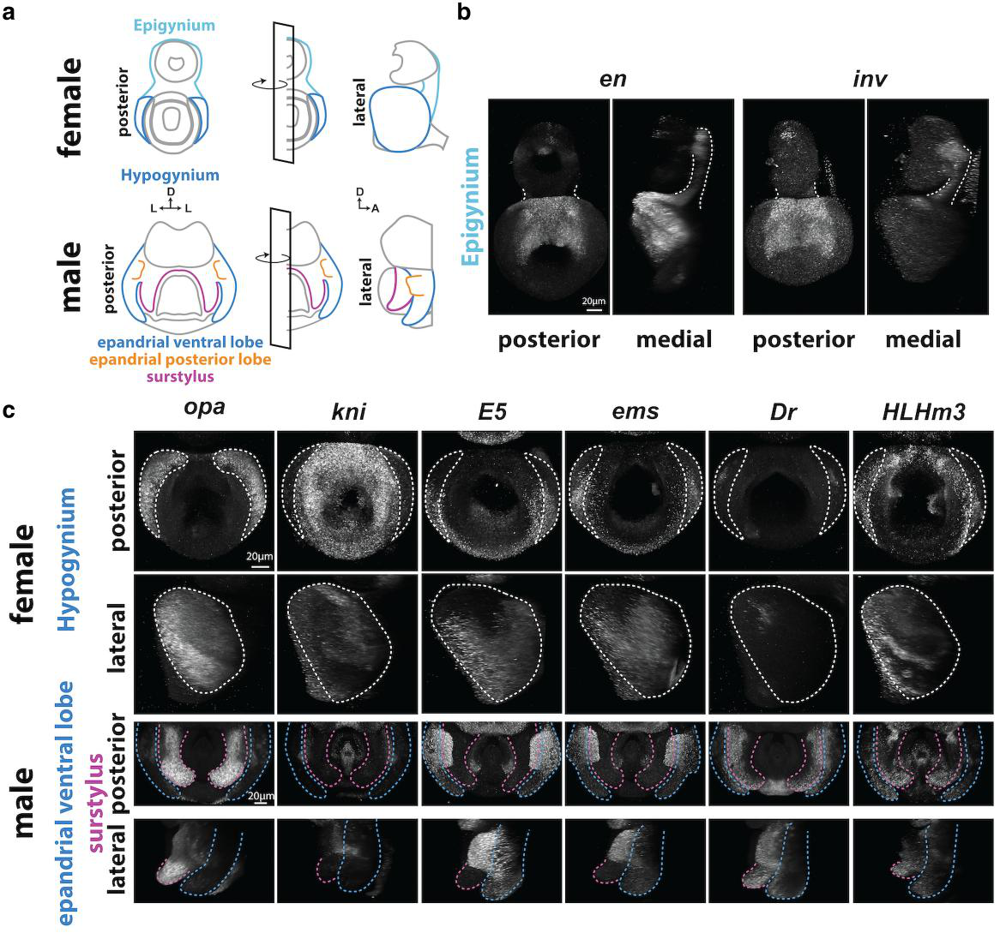
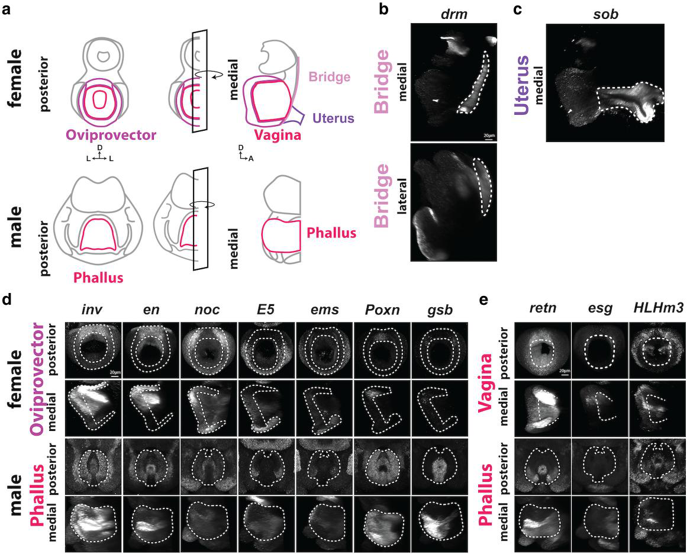
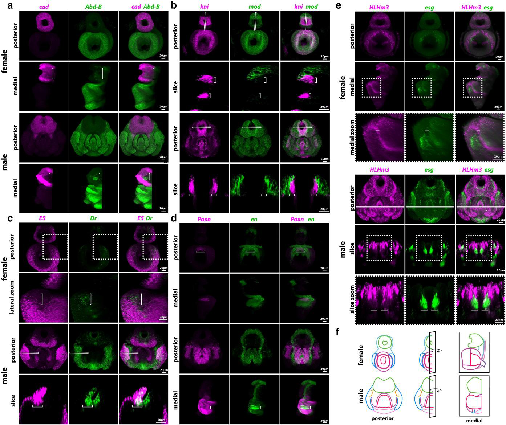

# Literature Review — Parallels in the regulatory landscape of dimorphic female and male genital structures in *Drosophila melanogaster*

> **Source:** [[Parallels in the regulatory landscape of dimorphic female and male genital structures in Drosophila melanogaster]] (McQueen, Rice, Pillai, Ziabari, Vincent & Rebeiz, *GENETICS*, 2025)
> **DOI:** [10.1093/genetics/iyaf221](https://doi.org/10.1093/genetics/iyaf221)

---

## 1. Background & Significance

A central question in evolutionary developmental biology is **how morphology evolves through changes in development**. One powerful approach is *comparative*: examine how the expression or function of key developmental molecules differs across homologous structures — between species, populations, the sexes, or different body parts of the same individual.

The **Drosophila genitalia (terminalia)** are an ideal system for this because:
- They are **developmentally tractable** (arise from the genital imaginal disc, patterned by Hox genes and the sex-determination pathway).
- They **evolve rapidly**, differing even between closely related species.
- They are **sexually dimorphic**, so male and female forms arise from a shared primordium.

The key gap this paper addresses: **female pupal genitalia are comparatively understudied.** Prior work (much of it from the same labs) characterized gene regulatory networks (GRNs) in *male* genital development. This study brings female genitalia up to the same standard, asking whether the same transcription factors pattern both sexes.

## 2. Research Question & Goals

The authors set out to:
1. **Trace female pupal genital development** — determine *when* and *how* individual female genital structures form during metamorphosis.
2. **Measure expression of 29 transcription factors** in both female and male genital structures at high resolution.
3. Determine whether **the same transcription factors** control developmental processes in both sexes, providing a resource for studying how genital GRNs specialize and evolve.

## 3. Methods

- **Developmental staging:** female pupal genitalia imaged at 4-hour intervals (44, 48, 52, 56 h after puparium formation, APF) during metamorphosis, from four orthogonal views (posterior, lateral, medial, ventral).
- **High-resolution gene-expression detection:** **hybridization chain reaction (HCR)** combined with **confocal microscopy** to visualize mRNA expression of 29 transcription factors.
- **Sex and structure comparison:** expression measured in female vs. male genital structures, in multiple orientations (posterior, lateral, medial, and optical slice views).
- **Dual-marker co-labeling:** several panels co-stain two markers (e.g., *cad*/Abd-B, *kni*/*mod*, *E5*/*Dr*, *Poxn*/*en*, *HLHm3*/*esg*) to map domain relationships.

## 4. Key Findings

- **Female genitalia are molecularly patterned into distinct subregions**, not uniform tissue — the epigynium, hypogynium, oviprovector, vagina, uterus, bridge, and analia (epiproct, paraproct, hypoproct) each have characteristic marker expression.
- **The same transcription factors are expressed in both sexes.** Markers found in male genital structures are also deployed in the corresponding female structures (e.g., oviprovector/vagina vs. phallus).
- Some markers serve as **marker genes for distinct female structures** (e.g., *drm* marks the bridge, *sob* marks the uterus).
- Expression domains are **sexually dimorphic in arrangement** — the same markers are deployed in different spatial configurations in males vs. females.
- The data support a model in which **shared transcription factors control developmental processes in female and male genitalia**, with sex-specific spatial deployment.

## 5. Figure-by-Figure Analysis

### Figure 1 — Developmental time course of female genitalia (44–56 h APF)

This is a **morphogenesis atlas**. Four stages (44, 48, 52, 56 h APF) are shown in four views (posterior, lateral, medial, ventral) as surface renderings with color-coded interpretive schematics.

**Interpretation:** The female terminalia undergo **substantial remodeling, not just growth**, during this window. The key transition is between 48 h and 56 h: the vaginal primordium **invaginates/folds from an open ring into a stellate internal lumen**, while the oviprovector and hypogynium/epigynium reorient around it. A dorsal "bridge" connects the genital and anal components, and the uterus extends ventrally. This documents the transition from **separate, bilaterally arranged primordia to an organized female terminalia with a defined vaginal opening and internal tract**. Color code: analia (green), epigynium (cyan), hypogynium (dark blue), oviprovector (purple), vagina (magenta); epiproct/hypoproct and bridge/uterus also labeled.

### Figure 2 — Analia marker expression (female vs. male)

A grid of seven markers (*cad*, *HLHm3*, *C15*, *fd96Cb*, *drm*, *sob*, *kni*) plus *Dr*, across female/male and posterior/lateral/medial views, with white dotted outlines standardizing the analia territory.

**Interpretation:** The analia are **molecularly patterned into distinct subregions** (epiproct, anus, paraproct, hypoproct). Each marker has a distinct spatial pattern, and several **differ between the sexes** — e.g., the female rounded posterior analia vs. the more elongated male lateral analia. This establishes that even the analia, not just the genital structures, are sexually dimorphic at the molecular level.

### Figure 3 — Epigynium and hypogynium vs. male posterior structures

Panel b: *en* and *inv* mark the **female epigynium** (posterior and medial views). Panel c: six markers (*opa*, *kni*, *E5*, *ems*, *Dr*, *HLHm3*) across the **female hypogynium** and the **male epandrial ventral lobe / surstylus** (color-coded blue/magenta outlines).

**Interpretation:** This is the paper's core homology/comparison figure. The female hypogynium is compared directly to the male epandrial ventral lobe and surstylus. The markers are **not uniform** — e.g., *opa* is strong at lateral/posterior rims, *kni* is broad and strong, *E5* is restricted/patchy, *Dr* is weak/absent in many regions. In males, the colored outlines show that some markers **preferentially occupy the epandrial ventral lobe vs. the surstylus**, revealing subdomain-specific programs. The message: homologous/analogous posterior genital regions are **not equivalent between sexes**; each marker has a sex- and structure-specific pattern.

### Figure 4 — Oviprovector/vagina vs. male phallus

Panel b: *drm* marks the female **bridge**. Panel c: *sob* marks the female **uterus*. Panel d: seven markers (*inv*, *en*, *noc*, *E5*, *ems*, *Poxn*, *gsb*) across the female **oviprovector** and male **phallus**. Panel e: *retn*, *esg*, *HLHm3* across female **vagina** and male **phallus**.

**Interpretation:** This is the most direct evidence for **parallels between the sexes**. The female oviprovector/vagina are compared to the male phallus, and multiple markers show **broadly comparable patterned expression** in both. Some markers are more structure-specific (*drm* → bridge, *sob* → uterus), but the broad similarity of *inv/en/noc/E5/ems/Poxn/gsb* and *retn/esg/HLHm3* supports **shared or corresponding developmental patterning** between female and male genital structures.

### Figure 5 — Dual-marker co-expression maps (compartmentalization)

Five dual-label panels: *cad*/Abd-B, *kni*/*mod*, *E5*/*Dr*, *Poxn*/*en*, *HLHm3*/*esg*, in female vs. male, posterior and medial/optical-slice views (magenta/green/merge columns).

**Interpretation:** This figure reveals the **combinatorial, compartmentalized marker code** patterning the genital primordia. The two markers in each panel occupy **related but distinct, only partially overlapping domains** — e.g., *cad* and Abd-B define neighboring posterior–medial territories; *HLHm3* forms dense longitudinal stripes in males with *esg* clusters nestled between them (the clearest sex-specific cellular arrangement). The optical-slice views are critical: they reveal **sexual dimorphism in cellular arrangement** that is not apparent in whole-mount posterior views. The central message: male and female genitalia deploy the same markers in **different spatial arrangements**, producing sex-specific compartmentalization.

## 6. Discussion & Implications

- **Female genitalia are no longer a black box.** This atlas brings female terminalia development to parity with the well-studied male system, enabling direct comparative analysis.
- **Shared transcription factors, sex-specific deployment.** The finding that the same TFs are expressed in both sexes — but in different spatial configurations — aligns with the emerging view that sexual dimorphism arises not from sex-specific genes per se but from **sex-specific regulation of shared developmental programs** (consistent with the *doublesex* → downstream GRN logic covered elsewhere in this vault).
- **A resource for GRN evolution.** By identifying marker genes for specific female structures, the paper enables future studies of how genital GRNs **specialize and evolve** in each sex, and across species.

## 7. Limitations

- **Expression ≠ function.** The atlas documents *where* markers are expressed but does not establish their functional roles in female genital development (no perturbation/RNAi/mutant data in this paper).
- **Descriptive, not quantitative.** Patterns are described qualitatively; no quantitative expression measurements or statistical comparisons between sexes are provided in the figures.
- **Homology vs. analogy not proven.** The paper compares corresponding structures but, as the authors note, does not by itself prove homology or regulatory causality between female and male structures (a theme taken up explicitly in [[Resolving between novelty and homology in the rapidly evolving phallus of Drosophila]]).

## 8. Connections to the Knowledge Base

- Builds on the **male terminalia** atlas work ([[A Standardized Nomenclature and Atlas of the Male Terminalia of Drosophila melanogaster]]) and the **transcription factor atlas** ([[An Atlas of Transcription Factors Expressed in Male Pupal Terminalia of Drosophila melanogaster]]).
- Extends the **doublesex / sex-determination** theme ([[Doublesex (dsx)]], [[Sex Determination in Drosophila]]) to the female side.
- Relevant to **evo-devo of genitalia** ([[Evolution of Genitalia]], [[Evo-Devo]]) and **genital disc patterning** ([[Genital Disc]], [[Morphogen Signaling]]).

## Related Papers

- [An Atlas of Transcription Factors Expressed in Male Pupal Terminalia of Drosophila melanogaster](../01_Sources/an-atlas-of-transcription-factors-expressed-in-male-pupal-terminalia-of-drosophila-melanogaster-2019.md)
- [A Standardized Nomenclature and Atlas of the Male Terminalia of Drosophila melanogaster](../01_Sources/a-standardized-nomenclature-and-atlas-of-the-male-terminalia-of-drosophila-melan-2019.md)
- [A standardized nomenclature and atlas of the female terminalia of Drosophila melanogaster](../01_Sources/a-standardized-nomenclature-and-atlas-of-the-female-terminalia-of-drosophila-mel-2022.md)
- [Evolution of sex-specific traits through changes in HOX-dependent doublesex expression](../01_Sources/evolution-of-sex-specific-traits-through-changes-in-hox-dependent-doublesex-expr-2011.md)

## Map

[[Drosophila Terminalia - MOC]]

---

#review #drosophila
