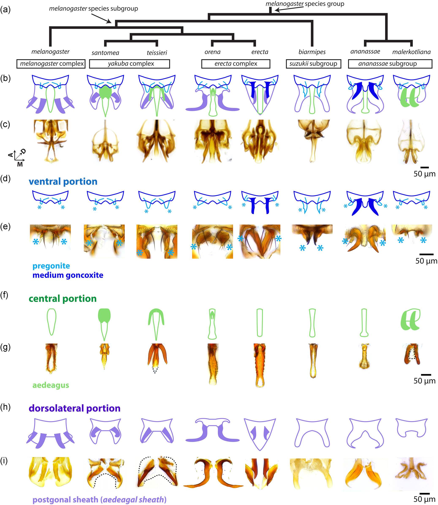

# Literature Review — Resolving between novelty and homology in the rapidly evolving phallus of Drosophila

> **Source:** [[Resolving between novelty and homology in the rapidly evolving phallus of Drosophila]] (Rice, David, Gompel, Yassin & Rebeiz, *J Exp Zool B*, 2023)
> **DOI:** [10.1002/jez.b.23113](https://doi.org/10.1002/jez.b.23113)

---

## 1. Background & Significance

The **phallus** of *Drosophila* is adorned with several **processes** (pointed outgrowths) that are similar in size and shape between species, but their **homology relationships** were ambiguous because they were assigned by adult position rather than developmental origin. This matters because **homology** (shared ancestry) vs. **novelty** (independent origin) is central to understanding when structures evolved and how the same gene regulatory network can be redeployed.

## 2. Research Question

Can **developmental analysis** resolve whether adult phallic processes are **homologous** or **novel** across species? Do phenotypically similar processes arise from the same or different pupal primordia?

## 3. Methods

- **Comparative developmental analysis** of phallic processes in **eight members of the *melanogaster* species group**.
- Identification of the **pupal primordia** from which each adult process forms.
- **Phylogenetic mapping** of the three phallus modules (ventral, central, dorsolateral).

## 4. Key Findings

- Adult phallic processes arise from **three pupal primordia** in all species examined.
- In some cases, the **same primordia generate homologous structures**; in others, **different primordia produce phenotypically similar but non-homologous structures**.
- The same **gene regulatory network** may be **redeployed to different primordia** to induce phenotypically similar traits.
- Traits diversify and can be redeployed even at **short evolutionary scales**.

## 5. Figure-by-Figure Analysis

### Figure 1 — Modular anatomy of the phallus across eight species

A phylogeny (a) with the phallus broken into three color-coded modules — **ventral portion** (pregonite/medium goncoxite, cyan), **central aedeagus** (green), and **dorsolateral postgonal/aedeagal sheath** (purple) — shown as schematics (b, d, f, h) and micrographs (c, e, g, i) for *melanogaster, santomea, teissieri, orena, erecta, biarmipes, ananassae, malerkotliana*. **Interpretation:** the phallus is best understood as a **modular set of partly homologous components**, not a wholly novel organ each time. The central **aedeagus retains a clearer one-to-one identity** across species, while the ventral and dorsolateral elements show the strongest divergence (hypertrophied hooks/plates in *orena, erecta, ananassae*; simplified states elsewhere). This sets up the homology-vs-novelty question per module.

## 6. Discussion & Implications

- **Developmental analysis can resolve contentious homology claims** that adult morphology cannot.
- Phenotypically similar structures can be **non-homologous** (different primordia) — a caution against inferring homology from appearance.
- The **same GRN redeployed to different primordia** is a mechanism for generating convergent/parallel traits and novelties.
- Directly relevant to understanding the **evolution of genitalia** and morphological novelty.

## 7. Limitations

- Focuses on the **phallus** in the *melanogaster* group; generality across other genital structures/species needs testing.
- Homology conclusions depend on the developmental staging/primordia identification.

## 8. Connections to the Knowledge Base

- Central to [[Evolution of Genitalia]], [[Evo-Devo]], and [[Drosophila Terminalia]].
- The novelty/homology theme connects to [[Co-option of an Ancestral Hox-Regulated Network Underlies a Recently Evolved Morphological Novelty]] and [[A Notch signal required for a morphological novelty in Drosophila has antecedent functions in genital disc eversion]].

## Related Papers

- [Co-option of an Ancestral Hox-Regulated Network Underlies a Recently Evolved Morphological Novelty](../01_Sources/co-option-of-an-ancestral-hox-regulated-network-underlies-a-recently-evolved-mor-2015.md)
- [A Notch signal required for a morphological novelty in Drosophila has antecedent functions in genital disc eversion](../01_Sources/a-notch-signal-required-for-a-morphological-novelty-in-drosophila-has-antecedent-2025.md)
- [Evolution of male sexual characters in the Oriental Drosophila melanogaster species group](../01_Sources/evolution-of-male-sexual-characters-in-the-oriental-drosophila-melanogaster-spec-2002.md)

## Map

[[Drosophila Terminalia - MOC]]

---

#review #drosophila
