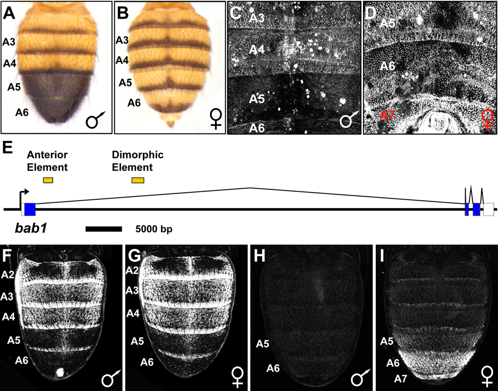
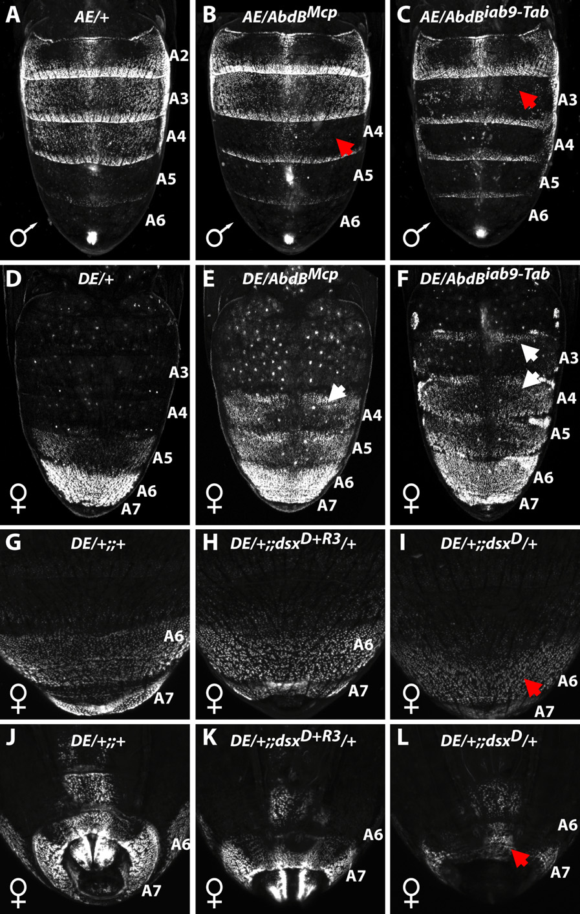
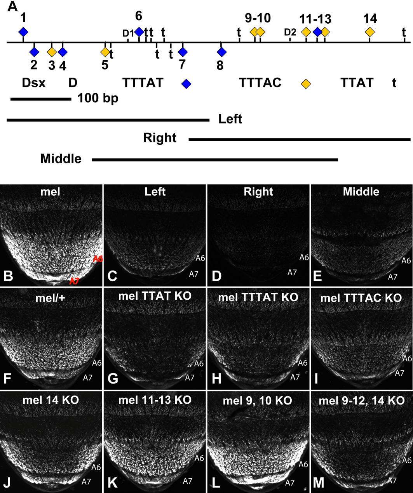

# Literature Review — The regulation and evolution of a genetic switch controlling sexually dimorphic traits in Drosophila

> **Source:** [[The regulation and evolution of a genetic switch controlling sexually dimorphic traits in Drosophila]] (Williams, Selegue, Werner, Gompel, Kopp & Carroll, *Cell*, 2008)
> **DOI:** [10.1016/j.cell.2008.06.052](https://doi.org/10.1016/j.cell.2008.06.052)

---

## 1. Background & Significance

Sexually dimorphic traits play key roles in animal evolution and behavior, yet the **mechanisms governing their development and evolution** were poorly understood. A classic example is the **male-specific abdominal pigmentation** of *D. melanogaster*: males have dark posterior segments (A5/A6), females do not. This dimorphism is **repressed in females by the Bric-à-brac (Bab) proteins**.

This paper identifies and traces the evolution of the **genetic switch** controlling dimorphic *bab* expression — showing how the **HOX protein Abdominal-B (Abd-B)** and the **sex-specific isoforms of Doublesex (DSX)** directly regulate a *bab* cis-regulatory element (CRE). It is a landmark demonstration of how a sex-determination effector and a Hox gene cooperate at a single enhancer.

## 2. Research Question

What is the **genetic switch** controlling sexually dimorphic *bab* expression, and how did it **evolve**? Specifically, how do Abd-B (Hox) and DSX (sex determination) regulate the *bab* CRE, and how did a new dimorphic expression domain arise?

## 3. Methods

- **Cis-regulatory analysis:** identification of *bab* enhancers (anterior element, dimorphic element) and reporter assays in the abdominal epidermis.
- **Genetic perturbation:** Abd-B regulatory mutants (*AbdB^Mcp*, *AbdB^iab9-Tab*) and *dsx* alleles (*dsx^D*, *dsx^{D+R3}*) tested against the *bab* enhancer reporters.
- **Enhancer dissection:** deletion mapping and site-directed mutation of individual Dsx/TTAT-family motifs within the dimorphic element.
- **Cross-species comparison:** tracing the evolution of the dimorphic element.

## 4. Key Findings

- **ABD-B and DSX directly regulate a *bab* cis-regulatory element.**
- In females, **ABD-B and DSX(F) activate** *bab* expression; in males, **DSX(M) directly represses** *bab*, allowing pigmentation.
- The *bab* locus is **modular**: a separate anterior element drives non-dimorphic segmental expression, while a dedicated **dimorphic element** drives female posterior expression.
- A new domain of dimorphic *bab* expression evolved through **multiple fine-scale changes within this CRE**, whose ancestral role was to regulate other dimorphic features.
- The dimorphic element has a **distributed, redundant enhancer architecture** (multiple partially redundant Dsx/TTAT-family sites).

## 5. Figure-by-Figure Analysis

### Figure 1 — bab expression and the modular bab1 regulatory architecture

Adult male (A) vs. female (B) abdomens show the dimorphic trait: males dark in A5/A6, females striped/light. Bab protein (C male, D female) is reduced in male posterior segments but extends posteriorly in females (A5–A7). Panel E maps the *bab1* locus with an **Anterior Element** and a **Dimorphic Element**. Reporter assays (F–I) show the anterior element is non-dimorphic (stripes in both sexes), while the dimorphic element drives female posterior expression (strong in A5–A7) and is weak/absent in males. **Interpretation:** the switch is modular — a dedicated dimorphic enhancer, repressed in males by the combined action of sex-determination and Hox pathways, generates the sex-specific posterior trait.

### Figure 2 — Abd-B and dsx inputs integrated through bab

A grid of male (A–C) and female (D–I) abdomens with Abd-B regulatory mutants (*Mcp*, *iab9-Tab*) and *dsx* alleles. Abd-B mutants cause sex- and segment-specific transformations (males: focal A3–A5 defects; females: ectopic anterior expansion). *dsx^D* disrupts the female posterior A6/A7 pattern and terminalia, while *dsx^{D+R3}* partially rescues it. **Interpretation:** Abd-B (Hox segment identity) and dsx (sex) inputs are integrated through *bab*; perturbing either shifts signal across segment boundaries and masculinizes/feminizes or disrupts the pattern.

### Figure 3 — The dimorphic element has a distributed, redundant architecture

Panel A maps a ~hundreds-bp enhancer with 14 numbered candidate sites (blue/yellow) and Dsx/TTAT-family motifs (TTTAT, TTTAC, TTAT), plus Left/Middle/Right deletion fragments. Panels B–M show A6/A7 reporter phenotypes: deleting Left or Right causes severe loss, but deleting Middle or knocking out individual Dsx/TTAT motifs (or even sites 9–12,14) only partially reduces signal. **Interpretation:** no single motif/site is solely responsible; multiple **partially redundant binding sites** collectively set the female-specific trait — explaining the robustness of the *bab* switch.

## 6. Discussion & Implications

- **New dimorphic characters can emerge from genetic networks regulating pre-existing dimorphic traits.** The dimorphic *bab* domain evolved by fine-scale changes in a CRE whose ancestral role was to regulate other dimorphic features.
- **Hox + sex-determination integration at a single enhancer** is a recurring theme (also seen in the sex comb, [[Evolution of sex-specific traits through changes in HOX-dependent doublesex expression]]).
- The **redundant enhancer architecture** explains robustness and provides evolutionary flexibility (multiple sites can be tuned incrementally).
- This is a foundational example of **cis-regulatory evolution** driving a sexually dimorphic trait.

## 7. Limitations

- Focuses on **abdominal pigmentation** (not terminalia per se), though the same regulatory logic applies to genital structures.
- The cross-species evolutionary tracing is qualitative; the exact historical sequence of fine-scale changes is inferred.

## 8. Connections to the Knowledge Base

- Directly parallels the terminalia logic: **Abd-B + DSX** patterning (see [[Abdominal-B (Abd-B)]], [[Doublesex (dsx)]], [[Sex Determination in Drosophila]]).
- The *bab* switch is relevant to [[Hox Genes]] and [[Evo-Devo]].
- Complements [[Genetic control and evolution of sexually dimorphic characters in Drosophila]] (Kopp et al., 2000), which established *bab* as the determinant.
- Enhancer-evolution theme connects to [[Co-option of an Ancestral Hox-Regulated Network Underlies a Recently Evolved Morphological Novelty]].

## Related Papers

- [Genetic control and evolution of sexually dimorphic characters in Drosophila](../01_Sources/genetic-control-and-evolution-of-sexually-dimorphic-characters-in-drosophila-2000.md)
- [Evolution of sex-specific traits through changes in HOX-dependent doublesex expression](../01_Sources/evolution-of-sex-specific-traits-through-changes-in-hox-dependent-doublesex-expr-2011.md)
- [Evolution of sexual development and sexual dimorphism in insects](../01_Sources/evolution-of-sexual-development-and-sexual-dimorphism-in-insects-2021.md)

## Map

[[Drosophila Terminalia - MOC]]

---

#review #drosophila
