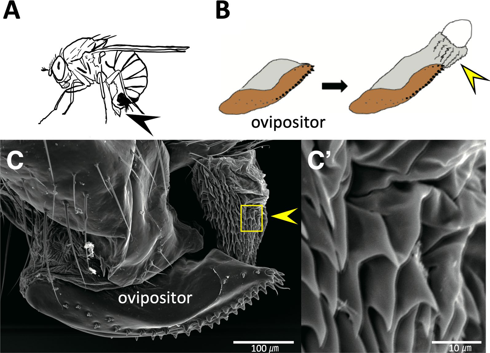
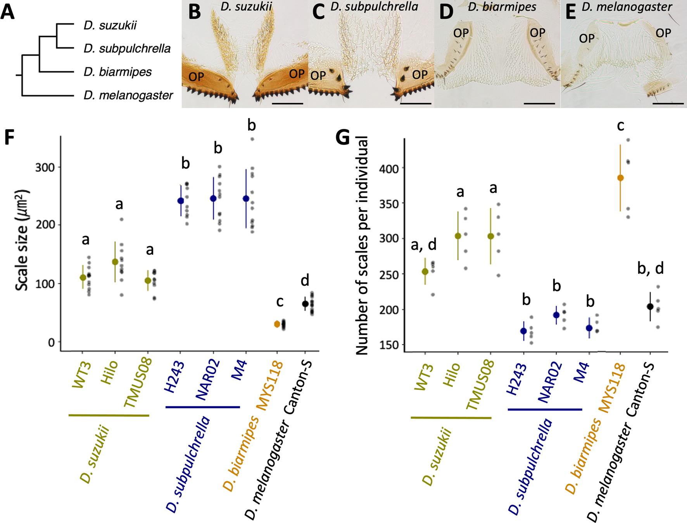

# Literature Review — Trichomes on female reproductive tract: rapid diversification and underlying gene regulatory network in Drosophila suzukii and its related species

> **Source:** [[Trichomes on female reproductive tract: rapid diversification and underlying gene regulatory network in Drosophila suzukii and its related species]] (Tanaka, Takahashi, Rice, Rebeiz, Kamimura & Takahashi, *BMC Ecology and Evolution*, 2022)
> **DOI:** [10.1186/s12862-022-02046-1](https://doi.org/10.1186/s12862-022-02046-1)

---

## 1. Background & Significance

This paper focuses on the **female side** of genital evolution — specifically the **trichomes/scales on the female reproductive tract** of *D. suzukii* and relatives. Female genital structures are often understudied relative to male genitalia, yet they evolve rapidly and are relevant to the ovipositor (egg-laying) function. It asks whether the **trichome-forming gene regulatory network** (centered on *svb*) underlies the diversification of these female-specific structures.

## 2. Research Question

How have **trichomes/scales on the female reproductive tract** diversified among *D. suzukii* and related species, and what **gene regulatory network** underlies them?

## 3. Methods

- **Comparative morphology:** light microscopy and SEM of female terminalia/reproductive-tract trichomes across *D. suzukii, subpulchrella, biarmipes, melanogaster*.
- **Quantification:** scale size (µm²) and number per individual across strains/species.
- **Phylogenetic framework:** mapping trait evolution.

## 4. Key Findings

- Females have a **dense field of microscopic cuticular trichomes/scales** on the reproductive-tract surface, exposed when the tract is everted near the serrated ovipositor during egg laying.
- Scale **size and number have diversified sharply** among species and appear **partly decoupled/traded off**: *D. subpulchrella* has few but very large scales, *D. biarmipes* has many tiny scales, *D. suzukii* combines numerous moderately sized scales with a serrated ovipositor, and *D. melanogaster* is relatively reduced.
- The trichomes are likely regulated by the **trichome-forming network** (svb-related), consistent with the co-option theme.

## 5. Figure-by-Figure Analysis

### Figure 1 — Female reproductive-tract trichomes

Lateral schematic (A), ovipositor/everted-tract schematic (B), and SEM (C, C′) showing the serrated ovipositor and a dense field of overlapping cuticular spines/trichomes (scale ~10 µm) on the everted reproductive-tract surface. **Interpretation:** establishes the female-specific trichome field as a real, prominent structure exposed during oviposition.

### Figure 2 — Diversification of scale size and number

Phylogeny (A: *suzukii*/*subpulchrella* sister, *biarmipes* next, *melanogaster* outgroup), micrographs (B–E), and plots of scale size (F) and number (G) across strains/species. **Interpretation:** scale size and number have **diverged sharply and partly traded off** — *subpulchrella* few+large, *biarmipes* many+small, *suzukii* numerous+moderate, *melanogaster* reduced. This documents rapid, mosaic evolution of female reproductive-tract trichomes.

## 6. Discussion & Implications

- **Female genital structures evolve rapidly** and are tractable for evo-devo, complementing the male-centric literature.
- The **trichome-forming network** (svb) is implicated in building these female-specific structures — an example of network co-option on the female side.
- The size/number trade-off suggests **independent regulatory control** of different aspects of the trait.

## 7. Limitations

- Focuses on **morphology/quantification**; the gene-regulatory detail (svb function) is less fully established here.
- Species sampling is limited to the suzukii lineage + outgroup.

## 8. Connections to the Knowledge Base

- The female counterpart to the male trichome novelty in [[Co-option of the trichome-forming network initiated the evolution of a morphological novelty in Drosophila eugracilis]].
- Relevant to [[Evolution of Genitalia]], [[Evo-Devo]], and the female terminalia atlas ([[A standardized nomenclature and atlas of the female terminalia of Drosophila melanogaster]]).

## Related Papers

- [Co-option of the trichome-forming network initiated the evolution of a morphological novelty in Drosophila eugracilis](../01_Sources/co-option-of-the-trichome-forming-network-initiated-the-evolution-of-a-morpholog-2024.md)
- [A standardized nomenclature and atlas of the female terminalia of Drosophila melanogaster](../01_Sources/a-standardized-nomenclature-and-atlas-of-the-female-terminalia-of-drosophila-mel-2022.md)

## Map

[[Drosophila Terminalia - MOC]]

---

#review #drosophila
